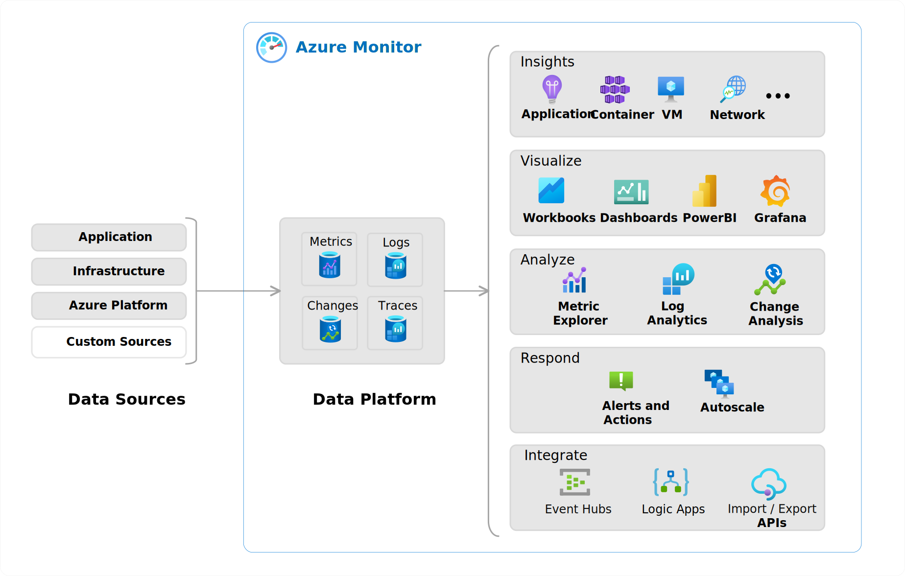

Azure Monitoring # **[prev](./why.md)** | **[home](./README.md)**  | **[next](./implement.md)**

# 2. Azure における監視の全体像と機能概要 <!-- no toc -->

## 目次 <!-- omit in toc -->

- [2. Azure における監視の全体像と機能概要](#2-azure-における監視の全体像と機能概要)
  - [2.1 Azure の監視の全体像](#21-azure-の監視の全体像)
  - [2.2 Azure Monitor の機能](#22-azure-monitor-の機能)
    - [2.2.1 データソース](#221-データソース)
    - [2.2.2 データプラットフォーム](#222-データプラットフォーム)
    - [2.2.3 データ利活用](#223-データ利活用)
  - [2.3 コストの監視](#23-コストの監視)
    - [コスト監視のポイント](#コスト監視のポイント)
    - [コストの表示とアラート](#コストの表示とアラート)
  - [2.4 そのほかのトピック](#24-そのほかのトピック)
    - [Azure Log Analytics エージェントと Azure Monitor エージェント](#azure-log-analytics-エージェントと-azure-monitor-エージェント)
    - [Log Analytics ワークスペースの配置](#log-analytics-ワークスペースの配置)
    - [Log Analytics ワークスペースの課金と利用状況の分析](#log-analytics-ワークスペースの課金と利用状況の分析)
    - [Log Analytics ワークスペースの権限管理](#log-analytics-ワークスペースの権限管理)

## 2.1 Azure の監視の全体像

Azure はさまざまなサービスを提供しており、それらのサービスを監視するための機能が用意されています。まずは Azure における監視の全体像を把握しましょう。

Azure の監視対象として、Azure のリソース以外に、セキュリティやコスト、オンプレミス環境が可能です。本章では、Azure のリソースにフォーカスし、それ以外の監視については必要に応じて補足していきます。

Azure のリソースを監視するには Azure Monitor を利用します。以下は Azure Monitor の機能の全体像です。



上図のように Azure Monitor の機能は主に 3 つのカテゴリで構成されています。

- データソース
  - Azure のリソースログやメトリック、OS のイベント ログ等のデータをソースとして収集する機能です。
- データプラットフォーム
  - データソースから収集したデータを保存するためのストレージ領域です。
- データ利活用
  - 収集したデータを利用するための機能です。

Azure Monitor でできる監視の内容や方法、コスト、機能についてカテゴリ毎に把握すると理解がしやすくなります。

|:question: Tips: Azure Monitor とは何か|
|:-----------------------------------------|
|ここまでの説明で Azure Monitor というサービスが提供されているように考えられることがありますが、Azure Monitor は 1 つの機能何かを指しているわけではありません。Azure Monitor は複数の機能の総称です。Azure Monitor が登場する以前はさまざまな監視機能がリソース単位やサブスクリプション単位で散らばっており監視機能への統一されたアクセスがありませんでした。そこで Azure Monitor としてリブランディングし、Azure の監視に関連する機能をまとめたものが Azure Monitor です。Azure Monitor の歴史については [こちら](https://learn.microsoft.com/ja-jp/azure/cloud-adoption-framework/manage/monitor/platform-overview#the-story-of-azure-monitor) のドキュメントを読むと分かります。|

Azure Monitor でできることの一例を以下に挙げます。

- Azure 上の仮想マシンやオンプレミスのサーバーのログ収集や CPU 使用率の監視ができます
- 収集した大量のログをクエリし、分析できます
- SQL Database や App Service、Application Gateway などの Azure リソースのログを収集できます
- ネットワークのログを収集しトラフィック量や送信元を解析し、攻撃を可視化します
- ストレージ アカウントにエクスポートし、ログやメトリックを長期保存できます
- Azure ポータルへのログインを監視し、不正アクセスを検知できます
- Azure のメンテナンスや障害情報をいち早く知ることができます
- ダッシュボードやブックを使用し可視化ができます
- アプリケーションと依存関係の問題を検出して診断します

次の節からは、上記の 3 つのカテゴリのそれぞれの機能を説明していきます。

### :exclamation: 重要: ログとメトリック <!-- omit in toc --> 

Azure Monitor を利用する上で必ず理解しておかなければならない概念・用語がログとメトリックです。

ログは文字列のデータで、OS のイベントログやアプリケーションのログが該当します。メトリックは数値のデータで、CPU 使用率やメモリ使用量が該当します。Azure Monitor では、ログとメトリックのいずれも収集し、保存、可視化ができます。

以下はメトリックの例です。


以下はログの例です。


注意が必要なポイントとして、ログとメトリックを扱うサービスが違う点、保存方法やコストが異なる点です。たとえば、ログを扱うには主に Log Analytics を利用し、メトリックを扱うには Azure Monitor のメトリック機能を利用します。また Log Analytics は課金が発生されるサービスですが、Azure Monitor のメトリックは無料で利用できます。しかし一方で、メトリックをログとして保存できる機能もあり、ドキュメントを確認する際や設計する場合に理解しておく必要があります。

以降の機能の紹介で詳しくログとメトリックについて説明します。

## 2.2 Azure Monitor の機能

この節では、Azure Monitor の 3 つのカテゴリの概要を説明します。まずはそれぞれのカテゴリの代表的な機能や利用方法を解説します。

### 2.2.1 データソース

データソースは Azure Monitor へデータを取り込むための機能群です。Azure のリソースのログやメトリック、OS のイベント ログ等のデータをソースとして収集できます。概要で紹介した図にあるデータソースのカテゴリにもとづいて、データソースの機能を紹介します。

#### Application

Application の監視は、Application Insights を利用します。Application Insights は Application Performance Management(APM) の一種で、アプリケーションにコードを埋め込むことで、アプリケーションのログやメトリックを Azure Monitor に送信できます。

アプリケーションのコードとして埋め込むことで、例外や依存関係を捕捉し、パフォーマンスの分析や効率的なトラブルシューティングを可能とします。

アプリケーションへの実装方法は言語やフレームワークによって異なります。以下は Node.js での実装例です。HTTP リクエストや例外情報の送信だけであれば以下のコードだけで実装できます。

```js
let appInsights = require("applicationinsights");
appInsights.setup("[your connection string]").start();
```

以下は失敗したリクエストを確認できるダッシュボードです。それぞれのリクエストにかかった時間や例外の種類が確認できます。


Application Insights の詳細については以下のドキュメントを参照してください。

[Application Insights の概要](https://learn.microsoft.com/ja-jp/azure/azure-monitor/app/app-insights-overview?tabs=net)

|:question: Tips: クラシック Application Insights のリタイア|
|:-----------------------------------------|
|独自のワークスペースを利用していた以前の Application Insights は 2024 年 2 月にリタイアすることが決まっています。Log Analtycs ベースのワークスペースへ移行する必要があります。詳細は以下のドキュメントを参照してください。<br>[ワークスペースベースの Application Insights リソースに移行する](https://learn.microsoft.com/ja-jp/azure/azure-monitor/app/convert-classic-resource)|

#### Infrastructure

Azure 上の仮想マシンやオンプレミスのサーバーのログ・メトリックを収集する機能です。従来からサーバーを監視するためにさまざまな製品が利用されているように、Azure Monitor でも同様の監視が可能です。

Azure 上の仮想マシンを監視する場合、観点として仮想マシンが起動しているホストと仮想マシン自体の監視があります。

仮想マシンのホストの観点で確認できることとしては、仮想マシンが利用している CPU 使用率やディスク I/O、ディスクキャッシュのヒット率、ネットワークスループットなどのメトリックです。

仮想マシン自体の観点で確認できることとしては、仮想マシン上の OS から見たログとメトリックです。ログはイベントログや syslog などの OS やアプリケーションが出力するログです。メトリックは CPU 使用率やファイルシステムの利用量、プロセス数があります。

仮想マシンホストのメトリック収集は、Azure Monitor の機能として既定で提供されており、設定や追加のサービス展開は必要ありません。一方で仮想マシンのログとメトリックは、OS にエージェントをインストールすることでデータを収集します。

また、Azure 上の仮想マシンだけでなく、他社クラウドやオンプレミス環境のサーバーのメトリックやログを取得も可能です。

次の図は上記の内容をまとめたものです。


以下に Infrastructure のデータソースの特徴を記述します。

- エージェントは `Azure Monitor エージェント` と `Log Analytics エージェント` の 2 種類
  - Log Analytics エージェントは2024年にリタイア予定のため、Azure Monitor エージェントを利用することを推奨
  - 詳細は後述
- Azure Monitor エージェントのインストールは、データ収集ルールを設定することで拡張機能として展開
  - 拡張機能の名前は、Linux は `AzureMonitorLinuxAgent`、Windows は`AzureMonitorWindowsAgent`
- Azure 以外の OS のデータを収集するためには Azure Arc に接続したうえでエージェントを展開
- Azure Monitor エージェントの Linux 拡張機能は以下のリポジトリで公開
  - https://github.com/Azure/azure-linux-extensions
- 参考ドキュメント
  - [Azure Monitor エージェントの概要](https://learn.microsoft.com/ja-jp/azure/azure-monitor/agents/agents-overview)
  - [Azure Monitor エージェントを使用して仮想マシンからデータを収集する](https://learn.microsoft.com/ja-jp/azure/azure-monitor/agents/data-collection-rule-azure-monitor-agent?tabs=portal)

なお、OS のログやメトリックの取得には、エージェントを利用する方法以外に、診断拡張機能を利用する方法もあります。診断拡張機能は、エージェントと別にインストールされる拡張機能で、拡張機能からストレージ アカウントのテーブルや Event Hub にデータが送信できます。以前は OS のメトリックをメトリック エクスプローラーへ送信するために使用されていました。しかしテーブルのメンテナンスが必要なことや簡単にクエリができないことから最近はログとしてのメトリックの収集や、Azure Monitor エージェントによるメトリックの送信が使われています。また、メトリックの保存期間が 14 日と短い点も注意が必要です。**すでにレガシーな機能であり、今後は Azure Monitor エージェントを利用することを推奨します。**

診断拡張機能については以下のドキュメントを参照してください。

[Azure Diagnostics 拡張機能の概要](https://learn.microsoft.com/ja-jp/azure/azure-monitor/agents/diagnostics-extension-overview)

以下の設定より診断拡張機能をインストールできます。


#### Azure Platform

Azure はデータベースや Web アプリケーションをホストするサービス、ファイアウォールを PaaS で提供しています。それらのリソースのログやメトリックも Azure Monitor で収集できます。たとえば、Web アプリケーションへのリクエスト数やファイアウォールのスループットがあります。ログとしては、Web アプリケーションのアクセスログやファイアウォールの通信ログがあり、`リソース ログ` や `診断ログ`と呼ばれます。


メトリックは、Azure Monitor の機能として既定で提供されており、追加の設定やサービス展開は必要ありません。

リソース ログは、各リソースのメニューにある`診断設定`から設定します。上記の通りリソース ログはリソースによって出力するログの種類が異なります。診断設定では、どのログをどこに出力するかを設定します。また、複数の設定ができるため、同時に複数の Log Analytics や ストレージ アカウントへ出力できます。

以下は Azure Firewall の診断設定で Log Analytics ワークスペースへ出力している例です。


また、以下は、App Service の診断設定でストレージ アカウントへ出力している例です。Azure Firewall とログのカテゴリが異なっています。


プラットフォームのログとしてはほかに、リソースの作成や削除、アラート、メンテナンス情報等の管理系のログを記録している `アクティビティ ログ`、 ユーザーのサインインや監査ログを記録している `Azure Active Directory ログ` があります。これらのログも、診断設定から出力先を設定できます。

`アクティビティ ログ`は特に追加の設定をしなくても Azure で90日間保存され、その後削除されます。複雑な検索や長期保存をするためには、Log Analytics ワークスペース等の外部のサービスに出力します。

`Azure AD`のログについても、特に追加の設定なく Azure で保持されます。ただし、Azure AD のライセンスによって保持期間や保存できるログの種類が異なります。詳細は
[Azure AD にレポート データが保存される期間](https://learn.microsoft.com/ja-jp/azure/active-directory/reports-monitoring/reference-reports-data-retention)を参照してください。

### 2.2.2 データプラットフォーム

データプラットフォームは、データソースから収集したデータを蓄積するためのストレージです。Azure Monitor のストレージは、大きく分けてログとメトリックのそれぞれで保存される場所が違います。ログはユーザーが作成した Log Analytics ワークスペースに保存され、メトリックは Azure Monitor のデータストアに保存されます。

#### Azure Monitor メトリック データベース

仮想マシンの CPU 使用率や App Service のリクエスト数等の数値で表されるデータは、データソースから `Azure Monitor メトリック データベース` に保存されます。


メトリック データベースは、ユーザーによる設定やサービスの展開をすることなく利用できる Azure Monitor 既定の機能です。メトリックデータの保存期間は、93日間です。コストも発生しません。

メトリックはデータによってディメンションを持っているものがあります。たとえば、仮想マシンのディスク I/O に関するメトリックは接続されているディスクごとで確認できる必要があります。ディメンションとしてLUNを持つことでメトリックの値を区別します。

メトリック データベースに対して、カスタム メトリックを定義してデータの収集が可能です。カスタム メトリックを利用するとユーザーが定義したメトリックをメトリック データベースに保存し、アラートや可視化が可能です。カスタム メトリックに対しては、保存容量に応じたコストが発生します。

メトリック データベースに保存されたデータは、後述するメトリック エクスプローラーから確認できます。

#### Log Analytics ワークスペース

Windows の イベント ログや Linux の Syslog などのログデータは、データソースから Log Analytics ワークスペースに保存できます。Azure リソースの診断設定で行ったログの出力も同様です。また、Application Insights を利用したアプリケーションからのログも Log Analytics ワークスペースに保存されます。

Log Analytics ワークスペースは、ユーザーが作成・管理します。データの保存にはコストが発生します。特に取り込むログ量への課金に多くのコストが発生するためログの取り込み対象の選定やワークスペースの分割が重要です。

Log Analytics ワークスペースに保存されたログは、ワークスペース内のストレージに構造化され格納されます。ログはデータソースに応じてテーブルが自動的に作成されそれぞれのテーブルに保存されます。たとえば、Application Gateway 等 Azure のリソースをデータソースにした場合、多くのリソースは、`AzureDiagnostics`というテーブルに保存されます。しかし、リソースによっては、リソース固有のスキーマを持ったテーブルに保存されることがあります。


Log Analytics ワークスペースに作成されたテーブルは、以下[テーブル]メニューから確認できます。


### 2.2.3 データ利活用

収集した監視データは、Azure Monitor の機能を使ってさまざまな方法で利用できます。この節では代表的ないくつかの利用方法を紹介します。

#### メトリック エクスプローラー

メトリックデータベースに保存されたデータを確認するにはメトリック エクスプローラーを使用します。メトリック エクスプローラーを確認するために追加の設定やリソースの展開は必要ありません。メトリック エクスプローラーは各リソースの監視のメニューからアクセスできます。

以下は仮想マシンの CPU 使用率をメトリック エクスプローラーで確認した例です。


メトリックの中には、ディメンション(次元)を持っているものがあります。たとえば、App Service は、CPU 使用率のメトリックを持っており、内部のインスタンスごとに CPU 使用率を確認できます。これは、CPU 使用率のメトリックに複数のディメンションを持っており、それぞれのメトリックにインスタンスの情報が含まれていることによるものです。メトリック エクスプローラーで確認するには、上部にある`分割を適用する`を利用します。


前述した通り、メトリックがデータベースに保存されている期間は93日です。メトリック エクスプローラー上で93日前までのデータが確認できますが、時間の範囲は最大30日のため、確認開始の日時を変更し30日ごとに確認していく必要があります。

|:question: Tips: メトリックの粒度と時間の範囲|
|:-----------------------------------------|
|Azure Monitor に収集されるメトリックはリソースによって断続的に送られるデータです。1分間に1回や5分間に1回等リソースが送信してきたデータを保存します。リソースによってこのサンプリングの間隔が異なるため、アラートの間隔等データを利用する際は注意しておく必要があります。|

- 参考ドキュメント
  - [Azure Monitor メトリックの概要](https://learn.microsoft.com/ja-jp/azure/azure-monitor/essentials/data-platform-metrics#multi-dimensional-metrics)

#### Log Analytics ワークスペース


データプラットフォームとしてストレージの役割を持つ Log Analytics ですが、取得したデータの検索や可視化をするための機能も備えています。Log Analytics ワークスペースに保存されたデータは、Kusto Query Language(KQL)と呼ばれるクエリ言語を使用してデータの検索が可能です。検索した結果は、グラフによる可視化やアラートによる通知として利用できます。

以下は、OS のログを KQL を使用して表示している例です。


Log Analytics ワークスペースで実行したクエリの結果は、アラートやダッシュボードのソースとしても使えます。Web Apps のアクセスログや OS のログを取り込むとさまざまな場面で活用できます。

##### Kusto Query Language(KQL) とは

Kusto Query Language(KQL) は、Log Analytics ワークスペース上で利用できる強力なクエリ言語です。テーブルからのデータ取得やフィルター、ソート、マージ等さまざまなテーブル操作が利用できます。KQL を使いこなすことで大量のログの中から必要な情報を見つけ出すことができるため、使い方を理解することで分析やトラブルシューティングに役立ちます。

いくつか基本的な使い方を紹介します。

- テーブルの情報を参照

次のクエリは、`Event` テーブルのデータを取得しそのうちの100件を表示するコマンドです。このように、テーブル名を記述することでそのテーブルの情報を取得し、パイプ(|)でさまざまな処理をつなげていくことが可能です。

```kusto
Event | take 100
```

- テーブルのフィルター

次のクエリはログとして保存したメトリックのテーブル(AzureMetrics)からリソース名(Resource)が `CH1-SQLVM12` でかつ、メトリック名が CPU 使用率(Percentage CPU)のレコードを取得します。`where` で条件を指定します。

```kusto
AzureMetrics
| where Resource == "CH1-SQLVM12" and MetricName == "Percentage CPU"
```

- 期間の指定とグループ化

次のクエリは、診断ログのテーブル(AzureDiagnostics)から、今日の1週間分でフィルターし、さらに1日ごとにグループ化しています。

```kusto
AzureDiagnostics
| where TimeGenerated > startofweek(now())
| summarize count() by startofday(TimeGenerated)
```

- 参考ドキュメント
  - [KUSTO 100+ knocks](http://aka.ms/ftakusto)

#### ブック

個々のリソースのメトリックやログはメトリックエクスプローラーや Log Analytics で可視化できますが、複数のリソースや異なるクエリを同時に確認したいことがあります。ブックを使うと、さまざまなデータの組み合わせや条件を指定して可視化ができます。

以下はブックでできることの一例です。

- 複数のサブスクリプションにまたがった複数の仮想マシンの CPU 使用率やメモリ使用量、ディスク使用率を表示
- サブスクリプション内の仮想マシンの可用性ゾーンの利用状況の表示
- Azure Firewall によって拒否されたトラフィックやスループットの表示

以下はデータソースとして利用できる一例です。

- メトリック
- ログ
- リソース グラフ
- JSON
- カスタム エンドポイント(外部 URL の呼び出し)

また、データの表示だけでなく、リソースの展開やほかのブックの呼び出し等の複雑なアクションを設定できます。

ブックのサンプルは以下の GitHub で公開されています。

[microsoft/Application-Insights-Workbooks](https://github.com/microsoft/Application-Insights-Workbooks)

以下にブックの活用例を紹介します。


ブックはJSON として保存されているため、既存のブックの取り込みやコピーが簡単に出来ます。以下の画面からブックの JSON を取り込むことができます。


#### アラート

Azure Monitor のアラートを利用すると、特定のリソースのメトリック・ログの変化に応じて、メールや SMS で通知を受け取ることができます。Azure Functions や Logic Apps、Webhook 等の外部のサービスとの連携もできるため、アラートのカスタマイズや複雑な処理を実現できます。

アラートを構成する上で必要な要素は、スコープ、条件、アクションです。

- スコープ
  - サブスクリプション全体や特定のリソースなどメトリックやログを持っている対象を指定します。
- 条件
  - 対象のスコープで利用できるシグナル(メトリックやログ)の指定、しきい値の設定、間隔等の条件を指定します。
- アクション
  - アラートがトリガーされた際に実行するアクションを指定します。

以下はアラートの条件として利用できるシグナルの代表的なものです。

- メトリック
- ログ
- アクティビティ ログ
- サービス正常性
- リソース正常性

※サービス正常性やリソース正常性は、アクティビティ ログの一種ですがアラートの設定としては別のシグナルとして扱われます。

メトリックやログはこれまでに紹介してきた方法で確認できる項目に対してアラートを設定できます。たとえば、メトリック エクスプローラーで確認しているメトリックに対してアラートを設定する場合、右上の`新しいアラート ルール`からアラートを作成できます。

|:question: Tips: アラートのステート|
|:-----------------------------------------|
|アラートにはステート(状態)の考え方があります。たとえば、メトリック アラートでCPU 使用率をアラートの対象とし、評価の頻度を1分にした場合、しきい値を超えたときにアラートが発報されます。その後、10分間しきい値を超えていたとしてもアラートは発報されません。10分後にしきい値よりも下回り、さらに3回連続で条件を満たさなかった場合に解消(Resolve)のアラートが発報されます。このような動きは、アラートが状態を持っている(ステートフル)ことから実現できる機能です。この動きをステートレスに変更することも可能です。<br>一方で、ログアラートは既定でステートレスです。メトリック アラート同様にステートフルに変更することもできます。詳細は以下のドキュメント、ブログ記事を参照してください。<br>[アラートと状態](https://learn.microsoft.com/ja-jp/azure/azure-monitor/alerts/alerts-overview#alerts-and-state)<br>[メトリック アラートの発報タイミングについて](https://jpazmon-integ.github.io/blog/AzureMonitorEssential/HowMetricAlertisFired/)|

サービス正常性アラートを設定すると、Azure の障害や計画メンテナンス、サービス終了通知等 Azure の管理に関わるアラートを受け取ることができます。利用しているサービスやリージョンでフィルターができるため、自分が利用しているリージョンやサービスを限定できノイズを減らすことができます。

リソース正常性アラートは、リソース個別の状態をチェックしアラートを発報します。リソースが正常と判断される方法はそれぞれのリソースによって異なります。正常な状態の条件については以下のドキュメントを参照してください。

[Azure Resource Health で利用できるリソースの種類と正常性チェック](https://learn.microsoft.com/ja-jp/azure/service-health/resource-health-checks-resource-types)

|:question: Tips: リソース正常性の利用方法|
|:-----------------------------------------|
|リソース正常性は個々のリソースの状態を知るための便利な機能ですが、使い方に注意が必要です。リソース正常性はあくまでも Azure のプラットフォームの観点で正常かどうかを判断しており、リソース正常性で正常であってもユーザーのサービスに異常がある可能性があります。また、リソース正常性の取得が何らかの理由で失敗し`不明`な状態となることもあります。リソース正常性は問題発生時のトラブルシューティングの1つとして活用し、過信しないように注意しましょう。|

#### Insights

複数のサブスクリプションにある大量のリソースから異常なリソースを迅速に特定することは至難の業です。Insights を利用すると、複数のサブスクリプションを跨いで、リソースをグループ化し状態を確認することが簡単にできます。リソースのメトリックや診断設定の情報を利用し、Azure Monitor によって用意されているダッシュボードで可視化されます。

以下にいくつかの Insights の例を紹介します。

- ストレージ アカウント


- ネットワーク インターフェイス


- ExpressRoute 回線


#### 番外編 : NSG フローログ <!--todo: Network Watcher の節にもっていく-->

Azure Monitor の機能ではありませんが、ネットワークフローをキャプチャーできるツールとして、Nework Watcher の NSG フローログがあります。NSG フローログは、NSG 単位で有効化しNSG によって許可・拒否された通信ログを JSON ファイルとしてストレージ アカウントに保存できます。

また、保存された JSON ファイルを解析するための機能として Traffic Analytics があります。Traffic Analytics は NSG フローログを解析し、Log Analytics に結果を保存します。さらに、ダッシュボード機能を持っているためネットワークフローの可視化ができます。

Traffic Analytics を利用すると、どこからどこへ通信が行われているか、通信が多いホストはどれか、どの国からの通信か等の情報をグラフィカルに確認できます。トラブルシューティングやセキュリティ監視をする上で便利な機能です。


## 2.3 コストの監視

Azure のサービスは従量課金のサービスが多く、利用量(トラフィック、時間、容量等)に応じた課金が発生します。また、それぞれのリソースで課金方法や単価が異なるため、利用量から料金を計算することは容易ではありません。Azure では、Cost Analytics 機能を利用してコストの監視が可能です。

### コスト監視のポイント

コスト監視は結果だけを見ていても効果的な監視になりません。コスト監視にも設計が必要です。以下のポイントを意識するとより効果的にコスト監視ができます。

#### Planning

クラウドは従量課金モデルが基本ですが事前にまったく見通しができないわけではありません。展開するワークロードに応じて利用するサービスやサービスに要求される性能、数、期間が決まります。しかし一方でオンプレミスのサーバーのような買い切りモデルではないため、利用状況に応じて変動するコストもあります。

クラウドのコストの見積もりで重要なことは、あらかじめ予測できる料金と可変の料金があることを認識し、可変の部分については、PoC を行うことで見積もりの精度を上げることです。可変の部分の要素としては、ユーザー数の増加やアーキテクチャーの変化に伴うパフォーマンスの追加(VM のスケーリング、SKU の変更、ネットワークの帯域の追加)がよくあります。バッファとして上乗せしておくことを検討します。

Azure では、料金の見積もりは Azure 料金計算ツールを使います。

[料金計算ツール](https://azure.microsoft.com/ja-jp/pricing/calculator/)

また、Azure Migrate を利用すると、オンプレミスの環境を分析し、Azure へ移行する際に必要な仮想マシンの性能を見積もることができます。

**根拠のある予算を計画することで監視時のしきい値と改善する際の指標に利用できます。**

#### Visibility & Accountability

コストの可視化と責任の所在を明確にします。どの期間で・何に・どのくらい利用が発生しているかを確認できるようにします。また、コストの責任を明確にし、コストの変化に確実に気付くことができ、アクションを取れるようにしておきます。

コストの確認は、予算と乖離がないか、異常値がないか等のポイントを確認します。Planning で検討した可変部分を特に注意深く確認します。

責任者やリソースの分類は、Azure のタグ機能を活用できます。タグでリソースの責任者や部署、あるいは利用目的(検証・開発等)、SLA(24x7・日勤帯等)を分類しておくと、改善の際に役立ちます。また、リソース グループやサブスクリプションの分割も有効です。

#### Optimization

コストの確認の結果によって最適化を検討します。最適化の方法は以下のようないくつかのポイントがあります。

- コストの削減の例
  - 仮想マシンのリサイズ等 サービスの SKU の変更
  - ストレージの階層(ホット、コールド、アーカイブ)の変更
  - PaaS(マネージドサービスの利用)
  - 使用していないリソースの停止・削除
- 支払い方法・ライセンスの最適化例
  - Reserved Instance の利用
  - ハイブリッド特典の利用

#### Iteration

上記のサイクルを繰り返します。毎月、四半期等で確認し、改善を繰り返します。利用開始直後は一週間単位など短い期間で確認することをお勧めします。

### コストの表示とアラート

サブスクリプションのメニュー、もしくは`コストの管理と請求`のメニューからコストの表示が可能です。ポイントは、どのサービスにどれだけ利用しているかをフィルター機能や観点(サービス名、リソース グループ、タグ等)を変えて確認することです。

以下の表示は1ヵ月の累積でどのくらいの利用量があるのかを確認できます。


以下は1日ごとの利用量に変更したグラフです。どのリソース グループが一番利用しているかを一目で確認できます。


また、表示だけでなくあらかじめ設定したしきい値に対してアラートを設定できます。機械学習によって検出された異常値をアラートとして設定が可能です。詳細は以下のドキュメントを参照してください。

[コストの異常と予期しない変化を特定する](https://learn.microsoft.com/ja-jp/azure/cost-management-billing/understand/analyze-unexpected-charges?source=recommendations)

## 2.4 そのほかのトピック

### Azure Log Analytics エージェントと Azure Monitor エージェント

前述の通り、現在仮想マシンへインストールするエージェントは過渡期にあり、Azure Log Analytics エージェント(Microsoft Monigoring Agent:MMA)と Azure Monitor エージェント(AMA)が存在します。Azure Log Analytics エージェントは、2024 年 8 月 31 日にサポート終了予定のため、移行する必要があります。

AMA はエージェントが再実装され、パフォーマンスが改善されています。また、データ収集ルールの機能によってフィルタや変換が可能になりました。

エージェントの比較は以下のドキュメントを参照してください。

[レガシ エージェントとの比較](https://learn.microsoft.com/ja-jp/azure/azure-monitor/agents/agents-overview)

主な違いについて以下にまとめます。

- 展開方法
  - AMA は一部の古い OS には対応していません。
  - AMA でオンプレミスのデータを収集するためには、Azure Arc エージェントをインストールしたあとに拡張機能としてエージェントを展開します。
  - AMA は`データ収集ルール`で収集元のリソース、対象のデータを指定します。同時に送信元を設定します。
    - この紐づけを行うと自動的にエージェントが仮想マシンに展開されます。
    - データ収集ルールを分けることで、仮想マシンごとに収集するデータの種類や収集先の変更が可能です。
- 収集できるデータ
  - AMA
    - 仮想マシンのメトリックとログを収集できます。メトリックは、メトリック データベースに送信され、ログは、Log Analytics ワークスペースに送信されます。
    - クライアント OS をサポートします。
  - MMA
    - 仮想マシンのログを収集できます。メトリックは収集できません。

|:question: Tips: Azure Monitor エージェント による Azure Monitor VM Insights|
|:-----------------------------------------|
|VM Insights は、仮想マシンから追加のメトリックを Log Analytics ワークスペースへ収集し仮想マシンの監視に役立つダッシュボードを提供します。VM Insights も Azure Monitor エージェントで利用できます。VM Insights とそれ以外のログやメトリックの収集を行う際は、正しく拡張機能がインストールされない等の事象が確認されているため別のデータ収集ルールを用いることが推奨されます。詳細はサポートチームのブログ確認してください。<br>[Azure Monitor エージェントを使用した Azure Monitor VM insights の有効化 (プレビュー)](https://jpazmon-integ.github.io/blog/LogAnalytics/Azure_Monitor_VM_insights_using_AMA/)|

### Log Analytics ワークスペースの配置

Log Analytics ワークスペースは、各リソースのログを収集し検索する境界になります。従ってワークスペースに収集するログのリソースや範囲を検討する必要があります。

管理性や検索性を重視し、1 つのワークスペースにサブスクリプションのすべてのリソースのデータを集約できます。しかし、すべてのログを集約するとデータの管理をしにくくなりクエリに長時間要する可能性があります。

一方で、プロジェクトや環境等ライフサイクルごとにワークスペースを分けることも可能です。ただしワークスペースを跨ってログ検索をする必要がある場合複雑なクエリを記述する必要があります。また、データ利用量に対するコミットメントの適用ができなくなりコストが高くなる可能性もあります。

ワークスペースの分割・展開は以下のポイントを考慮します。

- 運用データとセキュリティデータ
- Azure テナント
- リージョン
- データ所有権
- 課金

Log Analytics ワークスペースの設計戦略は以下のドキュメントを参照してください。

[Log Analytics ワークスペース アーキテクチャを設計する](https://learn.microsoft.com/ja-jp/azure/azure-monitor/logs/workspace-design#design-criteria)

### Log Analytics ワークスペースの課金と利用状況の分析

Log Analytics ワークスペースは、データの取り込まれたボリュームとデータの保有期間にもとづいて課金されます。以下は料金の詳細ページです。

[Azure Monitor の価格](https://azure.microsoft.com/ja-jp/pricing/details/monitor/)

価格表を見ると分かるように、データの取り込まれたボリューム(Analytics ログ)に対する課金は、1 GB あたり 400 円以上となっており、データの保有期間に対する課金(31日まで無料/31日以降 1 GBあたり 20 円程度)に対してコストの高い課金です。Log Analytics ワークスペースの利用状況の把握と最適化の方法を知っておくとコスト削減につながります。

ワークスペースの利用状況は、Log Analytics ワークスペースの`使用量とコスト`から確認ができます。1日当たりどのくらいのデータの取り込み量があるのか、どのくらいのデータが保持されているのかが分かります。また、過去31日間の使用量から、推定のコストも確認できます。


さらに、詳細に分析したい場合、Log Analytics ワークスペースの`分析情報`から確認ができます。


#### Log Analytics ワークスペースの最適化

Log Analytics は設計や運用によってコストボリュームが大きくなりがちなリソースです。どのようにログの取り込み量、保存容量を最適化できるか以下のポイントで検討します。

- 取り込み量の削減
  - 前述した通り、Log Analytics はデータの取り込み量に対する課金が保持容量に比べて高いコストモデルです。取り込み量を削減することでコストを抑えます。
  - 設計時にログの利用方法を検討し、利用方法に応じたログの取得を行います。
- 日次上限の設定
  - Log Analytics ワークスペースのログの取り込み量に日次上限(容量)を設定できます。上限を超えるとその日のログの取り込みが停止します。
  - 当然、取り込みが停止している間のログは確認が出来ないため設定は十分検討した上でおこないます。
- データ保有期間の設定
  - Log Analytics ワークスペースは既定で30日間データを保持します。
  - 保持期間を長期にしている場合は短くすることを検討します。
- 基本ログ
  - 既定の Analytics ログ(分析ログ)は、複雑なクエリと長期のデータ保持により迅速にログの分析ができる形式です。
  - 一方で、Basic ログ(基本ログ)を利用すると、利用できるクエリの限定とデータ保持の短縮(8日間)によってコストを抑えることができます。
  - ログをアラートの目的で使用し長期の保存はストレージ アカウント等へ保存する場合は、Basic ログを利用できる場合があります。
- アーカイブ ログ
  - 分析ログは、最大 730 日間の保持期間があり、その間は分析ログの料金が適用され保持されます。
  - アーカイブ ログを利用すると最大 7 年間データを保持でき、さらに保持にかかる料金が分析ログの料金よりも安くなります。
  - ただし、アーカイブされたログに対してクエリを実行する場合、分析ログにリストアするか`検索ジョブ`を利用してバッチとしてクエリを実行する必要があります。
- 参考ドキュメント
  - [Log Analytics の新機能 Basic Logs と Archived Logs について](https://jpazmon-integ.github.io/blog/LogAnalytics/BasicLogsAndArchivedLogs/)

### Log Analytics ワークスペースの権限管理

Log Analytics ワークスペースに取り込まれたログは、ワークスペースの権限とリソースの権限で参照可能な範囲が決まります。従って、Log Analytics ワークスペースを一元集約的に管理する場合、不必要に広範囲の権限を付与することを防ぐことが可能です。

#### コンテキスト

Log Analytics ワークスペースは、コンテキストという概念を持ちます。

- ワークスペース コンテキスト
  - Log Analytics ワークスペース全体に対するアクセス権限の範囲です。
  - ワークスペース コンテキストで参照できるアクセス権を持っている場合、リソースの権限を持っていなくてもログを参照できます。
- リソース コンテキスト
  - 個々のリソース(スコープ)に対するアクセス権限の範囲です。
  - ログへのアクセス時には、リソース へのアクセス権限のみが確認され、ワークスペースの権限が無視されます。
  - つまり、ワークスペースの権限を持っていなくても、対象のリソースのログを参照できます。

このコンテキストによって、たとえば、ワークスペースのすべてのログの参照はさせたくないが、リソースの権限を持っているユーザーにはそのリソースに関係するログを見せたい、ということが実現できます。


コンテキストは、Log Analytics のアクセスのしかたに影響します。ワークスペースからアクセスした場合、ワークスペースで持っているすべてのログにアクセスできます。一方でリソースのページからログにアクセスした場合、そのリソースをスコープとしたログのみが表示されます。


#### ワークスペースコンテキストの権限

ワークスペースコンテキストのアクセス権限は、監視ソリューションの追加や価格レベルの変更等のワークスペース全体にかかわるアクションに影響します。また Log Analytics に関する組込み権限として、閲覧者と共同作成者があります。


#### リソースコンテキストの権限

リソースコンテキストのアクセス権限は、リソース自体へのアクセスがある場合ログの参照が可能です。カスタムロールを作成することでログへのアクセスの制限も可能です。


以下はカスタムロールで細かなアクセス制御を行う例です。


#### 参考ドキュメント

- [Log Analytics ワークスペースへのアクセスを管理する](https://learn.microsoft.com/ja-jp/azure/azure-monitor/logs/manage-access?tabs=portal)
