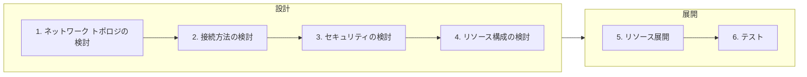

Azure Networking #2 - アプリケーション配信基盤の設計・展開 # **[prev](../overview.md)** | **[home](./README.md)**  | **[next](./case-study.md)**

# 3. アプリケーション配信のためのネットワーク設計ポイント

## 設計～展開のステップ

Azure のネットワークに関するほとんどのサービスは、 Azure ポータルから数ステップで展開でき、複雑な構成であっても数十分から数時間で展開できます。リソースの作成は非常に簡単ですが、後から変更できない設定が存在することや、後でネットワークの構成を変えるためにダウンタイムが発生することもあります。従って、オンプレミスのネットワーク設計同様、Azure へのネットワーク展開においても設計は非常に重要です。

以下に、Azure のネットワーク展開の流れを紹介します。主に設計にフォーカスし、それぞれのステップのポイントを解説していきます。

## 3.1. ネットワーク トポロジの検討

ネットワークの設計を考える上でまず重要なことはシステム全体のトポロジです。トポロジの設計を疎かにすると、場当たり的なネットワーク展開をすることとなり、可用性や運用性、セキュリティの低下につながります。

トポロジを検討する上で意識することは、東西通信と南北通信です。東西通信は、仮想ネットワーク間やデータセンター間、リージョン間のような`横`のつながりで発生する通信です。一方で、南北通信は、インターネットとの接続やオンプレミスとの接続等、データセンターから出ていく`縦`のつながりで発生する通信です。Azure だけでなくオンプレミス環境を含めたシステム全体のネットワークを前提として通信のフローを考慮します。

以下はトポロジの検討ポイントです。

|東西南北|接続方向|考慮事項|検討の重要性|
|--|:-------|------|---------|
|南北|インターネットへの接続|Azure の仮想ネットワーク内のリソース発信でインターネットへ接続する要件があるか確認します。よくある通信として、OS の更新プログラムの取得やミドルウェア、監視に利用される通信です。Azure を利用する上で必要な通信も発生する可能性もあります。特にパブリッククラウドを利用する上で、インターネットとの通信を含めたユーザーが完全に制御できない通信が発生することは基本的に避けられません。そのような通信の扱いをどう考えるかポリシーを検討する必要があります。|高い|
|南北|インターネットからの接続|Azure の仮想ネットワーク内のリソースに対して、インターネットからのアクセス要件を確認します。リフトアンドシフトのシナリオの場合においてはインターネットからの接続は限定的と考えられます。たとえば不特定多数のユーザーに対して Web サービスを公開する場合においてはインターネットとの接続ポイントが必要であり、そのような通信の必要有無を確認します。必要なリソースのみが確実にアクセス可能かつセキュアな状態を維持できるトポロジを検討します。|高い|
|東西|複数ネットワークの接続|システム規模が大きくなると、複数のネットワークの展開が必要な場合があります。たとえば情シス部門においてネットワークを集中管理したい場合等では管理主体が異なる複数のネットワークが展開されます。ほかにもマルチリージョンに展開された拠点を接続する場合も複数のネットワークが必要です。管理主体・管理方法の違いやリージョンの違いがあるネットワークが存在するのか、それらのネットワーク間をどのように接続するのか(接続しないのか)を検討します。複数の複雑な Azure のネットワーク間を接続する場合、 **ハブアンドスポーク** の構成をまずは検討します。|状況に応じて|
|南北|オンプレミスとの接続|リフトアンドシフトやデータセンターの拡張として Azure を利用する場合、既存のリソースや運用を維持するためにオンプレミスとの接続が必要な場合があります。必要な帯域幅やオンプレミスネットワークのトポロジ(冗長性・災害時の経路)を考慮しながら検討します。また Azure 上の仮想マシンが外部ネットワークへ接続する際にコンプライアンス要件と齟齬がないことを確認します。たとえば、インターネットへの接続が発生する場合に、オンプレミスのプロキシサーバーやファイアウォールの利用を必須とする場合、強制トンネリング等特殊な設定を利用しなければならない場合があります。|状況に応じて|
|東西南北|Azure サービスとの接続|システムによっては Azure の PaaS サービスとの接続(インターネットではないもののユーザーの管理下にないネットワークとの接続が必要なサービス)を利用することがあります。PaaS との接続は Azure のしくみを利用して管理・制御できます。PaaS の利用についても、その扱い(外部接続として扱い可能な限り制御したいのか、柔軟性を持たせたいのか)を検討します。|状況に応じて|

### アプリケーションの特性の確認

アプリケーション配信のプラットフォームとしてネットワークトポロジーを検討する上で重要なことは、アプリケーションのシステム要件や特性を十分に理解しておくことです。IaaS の VM 上にアプリケーションを展開するのか、コンテナを活用したマイクロサービスを Kubernetes 上に展開するのか、アプリケーションコードを PaaS リソース上に展開するのか、サーバーレスアプリケーションを組み合わせて展開するのか等によってネットワークトポロジーが大きく変わります。

特に PaaS リソースを利用する場合、その PaaS リソースで利用できるネットワーク機能に依存することもあるため、サービス選定の際はネットワークの要件も含めて検討します。

アプリケーションを配信するプラットフォームは原則冗長性を持たせることを前提とし、負荷分散サービス(ロード バランサー)と組み合わせて利用します。

以下に挙げる項目も含めて考慮します。

#### 公開範囲、シングル/マルチテナント

社内からのアクセスのみなど一部の限定されたユーザーを対象にするのか、もしくはインターネットに公開され不特定のユーザーを対象にするのかを確認します。

社内からの限定されたユーザーからのみアクセスさせたい場合やデータを特定のリージョンに閉じ込める必要がある場合においては、Front Door のようなリージョンを持たない一部のサービスは適さないことがあります。

また、1 つのアプリケーション(システム)を 1 ユーザーのみに利用させるシングルテナント、もしくは複数のユーザーや企業に利用させるマルチテナントのようなアーキテクチャーの違いによって、求められるスケーラビリティやセキュリティ要件が異なることもあります。その要件によりネットワークトポロジーが変わることもあります。

#### SLA

ワークロード(アプリケーション)で必要な SLA を確認します。SLA はシステム構成におけるすべてのコンポーネントの可用性を決める上でのベースラインとなります。

SLA を確認したうえで、どの通信経路(パス)に障害が発生するとどのような影響を及ぼすかを検証します。たとえば、ユーザーからの通信を受け付けるエンドポイントに障害が発生した場合、EC サイトのようなワークロードでは致命的な影響が発生することとなります。一方で、メッセージングサービスのような非同期なサービスとの通信においては、アプリケーションにおけるキャッシュやリトライでカバーできる可能性があるため、それほど影響はないと考えることもできます。

ちなみに、Azure の GA しているほぼすべてのサービスには SLA の定義がありますが、SLA が 100 %のサービスはほとんどありません。つまり、機能上 SLA が 100 % のシステムは展開できないことを意味します。また、メンテナンス等の運用を考えても SLA が 100 % のシステムは現実的でないと言えます。
システムの SLA を基にアーキテクチャーやネットワークトポロジーを考慮する際において、SLA が 100 %の構成を目指するよりも、予期しない障害に対していかに回復性を持たせるかを考えることが現実的でかつ重要です。

#### 機能要件

ワークロードで使用する機能やプロトコル等の通信要件を確認します。以下に一例を挙げます。

- プロトコルの確認(HTTP/HTTPS/それ以外)
  - いわゆる Web アプリケーションでは、HTTP/HTTPS を用いられることが多く対応したサービスは豊富にあります。逆に HTTP/HTTPS でないプロトコルを使用する場合、利用できるサービスが限られることがあります。
- TLS(HTTPS) の利用
  - クライアントからの HTTPS アクセスを復号化する TLS 終端を利用する場合、該当するサービスを選択する必要があります。また証明書の管理方法を確認します。
  - HTTPS を使用する場合、クライアントの要件として SSL のバージョンや暗号スイートが要件となっていることがあります。要件によっては SSL のポリシーを選択できるサービスを利用する必要があります。
- セッションアフィニティの必要性の有無
  - HTTP では Cookie を利用したセッションアフィニティ(1 つのリクエストを同一のバックエンドに振り分けるしくみ)があります。このしくみを使うためにはセッションアフィニティを利用できるサービスを選択する必要があります。ただし、スティッキーセッションを利用したステートフルなアプリケーションは可用性やスケーラビリティが低下することにつながることもあるため、可能な限りステートレスにすることを検討し、セッション情報を持つ場合であっても外部のストアに保存する検討が必要です。
- WAF の利用
  - インターネットから不正なアクセスをブロックするために Web Application Firewall(WAF) を利用することは推奨される構成です。WAF 機能の有無やサービスの持っている機能を考慮したうえでサービスを選択します。
- キャッシュの利用
  - クライアントからのアクセスをキャッシュし、バックエンドの負荷の削減やレイテンシーの最適化ができます。キャッシュ機能を持っているサービスを選択する必要があります。

#### フェールオーバー

アプリケーションの障害や災害対策を考慮して複数のリージョンやゾーンへのリソースを展開することはよくあるパターンです。可能な限りダウンタイムを減らし運用を継続するためには、アプリケーションの特性に加えフェールオーバーやフェールバックのポリシーを十分に考慮しておく必要があります。アプリケーション配信のプラットフォームを展開する上でフェールオーバーの機能はサービスに大きく依存するため初期フェーズで検討しておきます。

以下に考慮が必要ないくつかのポイントを挙げます。

- アプリケーションの正常性の定義
  - フェールオーバーの前提としてアプリケーションの正常状態・異常状態を定義する必要があります。どのような方法であっても正常・異常の状態が定義できない限りアプリケーションのフェールオーバーは実装できません。異常状態としてたとえば、HTTP のヘルスチェック用のエンドポイントに対する GET メソッドのアクセスで 5 回のアクセス中 3 回失敗する、といったような定義ができます。
- 障害時における影響範囲とダウンタイムの許容範囲
  - 障害時においてどの程度の障害に対してどの程度のダウンタイムを許容するか検討します。要件によってはアクティブ/アクティブ構成やバックアップからのリカバリも選択肢となることがあります。
- フェールオーバー時のアプリケーションの動作
  - Web アプリケーションのフェールオーバーを行うとそれまで処理していたセッションやトランザクションが切断されることとなります。その際にアプリケーションとして不整合が発生しないような実装となっていることを考慮しておく必要があります。
- 自動フェールオーバーの可否
  - フェールオーバー機能を備えているサービスは基本的に自動的なフェールオーバー機能を持っており、これを活用することで人の手を介すことなくアプリケーションの再開を可能とします。しかし、たとえばアプリケーションの実装としてフェールオーバー前に所定のオペレーションを必要とする場合等では自動フェールオーバーをあえて使わないという選択をする必要があります。
- フェールバックの有無とフェールバック時の考慮
  - フェールオーバーしたアプリケーションを元の状態に戻す(フェールバック)ことが必要かどうかを検討します。フェールオーバーと同様にフェールバックに対応したアプリケーションの実装になっているかどうかを確認する必要があります。また Azure のサービスによってはストレージ アカウント等フェールオーバーと同じ手順を取れないサービスがあるためそのようなサービスを利用している際は注意が必要です。

#### PaaS リソースとの接続

Web アプリケーションのワークロードにおいて Web サーバーやアプリケーションサーバーのみで構成されることは少なく、多くの場合リレーショナルデータベース等のデータストアと連携します。特にクラウドではデータベースをマネージドサービスとして提供しておりこれを使うことができます。また、データベースだけではなく非同期処理のためのメッセージングサービスやサーバーレスサービスとの連携をする場合もあります。

これらの PaaS リソースをシステムの一部として組み込む場合においては、セキュリティ・可用性を考慮したうえでどのような機能を利用できるか確認しておく必要があります。上述したように PaaS リソースはそのサービスごとで提供しているネットワーク機能が異なるものもため、特定のサービスで使える機能が別のサービスで使えないことがあります。

## 3.2. 接続方法の検討

トポロジを検討したうえで、具体的にどのようなサービスを利用してネットワークの接続性を確保するかを検討します。

接続方法を検討するうえで特に重要なことは、**それぞれのサービスの機能や制限を十分に理解すること**です。1 つの接続方法を実現するためにさまざまな方法が利用できますが、そのそれぞれの方法がシステムの要件に合っていることを確認する必要があります。設計フェーズだけでなく運用開始後の管理や拡張性の観点も考慮し、運用のし易さ・拡張性の高さ・セキュリティを考慮したサービス選定を行います。

ネットワークに関するサービスだけではありませんが、サービスを選定する際に意識しておくべき点は SLA です。1 つのサービスでも SKU によって SLA が異なります。しかし、多くのサービスではSLA が高くなるとコストも高くなることがあるためシステム要件と予算を考慮して選定します。

サービスについても東西南北のそれぞれの観点で検討すると整理がしやすくなります。

|東西南北|接続方向|サービス例|考慮事項|
|--|:-------|------|---------|
|南北|インターネットへの接続|Azure Firewall / NAT Gateway / Public IP Address|Azure では特に追加のサービスなくインターネットへの通信が可能です。しかし、セキュリティやパフォーマンスを考慮すると既定の接続方式では十分でないことがあるため要件に応じて適切な方法を選択します。|
|南北|インターネットからの接続|Azure Front Door / Application Gateway / Load Balancer / Public IP Address / Azure Bastion|インターネットからの接続の多くは HTTP による Web アプリケーションのための接続です。セッションアフィニティや TLS 終端、キャッシュ等 Web アプリケーションに特化したサービスの利用を検討します。HTTP 通信以外に、インターネット経由で管理目的の通信が必要な場合は Azure Bastion の利用を検討します。|
|東西|複数ネットワークの接続|Virtual WAN / ピアリング / VPN Gateway|Azure のネットワーク間の接続はほとんどの場合、ピアリングもしくは Virtual WAN で実現できます。**ハブアンドスポーク**構成を採用する場合、ハブとなる仮想ネットワークに Azure Firewall や ExpressRoute 等の共通のリソースを展開し、各スポークの通信をハブで制御できる構成を取ります。|
|南北|オンプレミスとの接続|VPN Gateway(Site-to-Site/Point-to-Site) / ExpressRoute|オンプレミスとの接続が必要な場合、VPN Gateway もしくは ExpressRoute を使用します。特定の端末と VPN Gateway を接続できる Point-to-Site を利用することもできます。ExpressRoute のフェールオーバー先として VPN を使用する場合、両方のゲートウェイを展開します。|
|東西南北|Azure サービスとの接続|プライベート エンドポイント / サービス エンドポイント|PaaS との接続をセキュアにするために、サービス ピアリングもしくはプライベート エンドポイントを利用します。プライベート エンドポイントを利用すると、プライベート IP アドレスで PaaS リソースにアクセスが可能になります。よりセキュアな方法としてプライベート エンドポイントを活用できますが、対応していない PaaS リソースもあり、その場合代替手段を利用する必要があります。|

### 負荷分散サービスの選択

アプリケーションを配信するためのプラットフォームとして冗長性やセキュリティを考慮すると、負荷分散サービスを組み合わせることが推奨されます。IaaS VM としてアプリケーションを展開する場合、単一の VM の障害時の可用性を確保するために 2 台以上の VM を展開する必要があります。また Web Apps のような PaaS リソースを利用する場合、レイテンシーの最適化やキャッシュの利用、WAF によるハードニングを考慮する必要があります。

このような考慮を組み込んだ構成を展開するには負荷分散サービスを利用します。負荷分散サービスはアプリケーションの特性によって正しいサービスを選択する必要があります。以下は、Azure の負荷分散サービスです。

- Front Door
- Traffic Manager
- Application Gateway
- Load Balancer

以下に負荷分散サービスを選択する際のポイントを説明します。

#### HTTP か HTTP 以外か

負荷分散サービスを選択するためにまず確認するポイントは、アプリケーションの利用するプロトコルが HTTP もしくは HTTP 以外かです。HTTP の負荷分散サービスとして、`Front Door` もしくは `Application Gateway` を利用できます。また、HTTP 以外の負荷分散サービスとして、`Traffic Manager` もしくは `Load Balancer` を利用できます。

HTTP 以外の負荷分散サービスを HTTP の負荷分散サービスとして利用できますが、キャッシュや WAF 等の レイヤー 7 の機能がないため多くのケースで適しません。

#### グローバルの負荷分散とリージョン内の負荷分散

アプリケーションを公開するためのサービスとして、Azure にはリージョンを持たないサービスとリージョンを持つサービスがあります。

リージョンを持たないサービス(グローバルリソース)は Microsoft のエッジに展開されます。アプリケーションはユーザーによってリージョンに展開されますが、そのリージョンに到達するまでの経路で通信が処理されます。代表的なサービスは、`Front Door` や `Traffic Manager`、`リージョン間ロード バランサー` です。グローバルリソースのメリットは Microsoft のエッジで動作するためリージョン間の負荷分散ができる、ユーザーに近いエンドポイントからルーティングすることでパフォーマンスの向上が見込める、キャッシュが利用できる、攻撃性のある通信をユーザーが展開したリージョンリソースへ到達する前に検知・拒否できる等です(Traffic Manager は名前解決ベースの負荷分散のため利用方法が異なる点もあります)。

一方で、リージョンを持つサービスは、主に仮想ネットワーク内(リージョン内)の負荷分散をするために利用します。サービスとして、`Application Gateway` や `ロード バランサー` があります。

グローバルな負荷分散サービスを同一のリージョン内の VM 等のリソースに対しても利用できますが、個々のリソースに特化した負荷分散機能(接続のドレインや設定の反映時間等)を考えると、同一リージョン内のリソースの負荷分散はリージョンを持つ負荷分散サービスを利用することをまずは検討します。

上述した内容を以下にまとめます。

|サービス|グローバル/リージョン|プロトコル|
|---|---|---|
|Front Door|グローバル|HTTP|
|Traffic Manager|グローバル|HTTP 以外|
|Application Gateway|リージョン|HTTP|
|Load Balancer|リージョン|HTTP 以外|

次の図は負荷分散サービスを選択する際のディシジョンツリーです。

|:question: Tips: 負荷分散サービスの組み合わせ|
|:------------------------------------------|
|上記のディシジョンツリーでは、Front Door と Application Gateway のように複数の負荷分散サービスを組み合わせたパターンがあります。グローバルとリージョンの機能のそれぞれの特徴を活かして、高可用性かつセキュアな構成を最大のコストパフォーマンスで展開することを検討します。|

### PaaS リソースの接続制限

Azure の PaaS リソースはグローバル IP アドレスを持つリソースであり、既定ではインターネット上からアクセスが可能です。Azure のリソースへ不特定多数のユーザーがアクセスできる状態はセキュアでないため、リソースのアクセスを制限することが推奨されます。サービスによって利用できるアクセス制限の方法は異なるため確認する必要がありますが、以下は主な制限の方法です。

- PaaS リソースが持つファイアウォール機能(インターネットとの直接接続)
  - サービスによっては、接続元を IP アドレスで制限できる機能を持っているものがあります。IP アドレスベースのため接続元の IP アドレスが特定できない場合や意図しないタイミングで頻繁に変更されてしまう場合は利用できません。
- VNet インジェクション
  - PaaS リソースを特定の仮想 ネットワークに注入(インジェクション)する方法です。PaaS リソースの IP アドレスは、仮想ネットワークのサブネットから払い出されます。
- プライベート エンドポイント
  - 仮想ネットワークに PaaS リソースと紐づいた NIC を展開し、プライベート IP アドレスでアクセスできるようにする方法です。プライベート IP アドレスで IaaS リソースやオンプレミスからの接続が可能です。特定のソースから特定の Paas へのアクセスを限定できます。
- サービスエンド ポイント
  - 仮想ネットワークのサブネットと PaaS リソースを紐づける方法です。PaaS へのアクセスは既定と同じくグローバル IP アドレス経由でアクセスします。仮想ネットワークに特別なルートテーブルが設定されます。無料で利用できます。

|:question: Tips: プライベート エンドポイントとサービス エンドポイントの使い分け|
|:------------------------------------------|
|プライベート エンドポイントとサービス エンドポイントは、PaaS リソースへのアクセス制限の点においては同じ結果となるため、どちらを利用してよいか悩むケースがあります。結論として、プライベート エンドポイントを使えるサービスであれば、プライベート エンドポイントを使うことをお勧めします。理由の 1 つとして、サービス エンドポイントは、仮想ネットワークから特定の PaaS リソース以外へのアクセスが限定できないためです。たとえば、サービス エンドポイントを使ってストレージ アカウントのアクセス制御をした場合、そのストレージ アカウントへは、特定のサブネットからしかアクセスできなくなります。しかし、仮想ネットワークから別のストレージ アカウントへのアクセスはできてしまいます。仮想ネットワークから意図しないストレージ アカウントへのデータ流出の考慮が必要な場合、サービス エンドポイントでは防ぐことができません。一方で、プライベート エンドポイントを利用すると特定のプライベート IP アドレスが払い出されるためアクセス制限を行うことができます。|

### セッションの追跡

Azure の負荷分散サービスにおいて特にレイヤー 7 を扱う `Front Door` や `Application Gateway` を利用する場合、セッションの追跡をできるようにしておきます。レイヤー 7 のサービスはクライアントからのリクエストをサービスにより一度終端したうえでバックエンドにコネクションを張りなおすため、メンテナンスや障害時にどのサービスまでコネクションが到達できていたか調査を必要とする場合があります。

たとえば、`Application Gateway` では、クライアントからのリクエストごとに GUID を生成し、`x-appgw-trace-id` としてヘッダーに追加します。また、この GUID は診断ログとして `transactionId_g` 列に出力されるため、`Application Gateway` までリクエストが到達できたのか、アプリケーションまでリクエストが到達できたのか調査ができます。

## 3.3. セキュリティの検討

Azure のネットワークセキュリティを考慮する上での基本的な設計ポイントは、`インターネットとの接続`、`セグメント化`、`暗号化`、`監視` です。

セキュリティについては以下のコンテンツも参照してください。

- 参考: [ネットワークに関する検出項目](https://github.com/Azure/fta-japan/blob/main/FTALive/DefenderForCloud/findings.md#%E3%83%8D%E3%83%83%E3%83%88%E3%83%AF%E3%83%BC%E3%82%AF%E3%81%AB%E9%96%A2%E3%81%99%E3%82%8B%E6%A4%9C%E5%87%BA%E9%A0%85%E7%9B%AE)

### インターネットとの接続

パブリッククラウドを普段から利用していると意識が、世界中のあらゆるユーザーが利用しているインターネットは非常に危険なネットワークです。安全にクラウドを利用するためにはインターネットとの送信・受信通信を確実に保護することが必要です。

**受信接続** 接続方法でも解説したように、インターネットからの接続(受信)の多くは Web アプリケーションのための HTTP 接続です。HTTP の保護に関するサービスはさまざまありますが、Web Application Firewall(WAF) を利用できるものを優先して選択します。WAF を使用すると、クロスサイトスクリプティングや SQL インジェクション等のアプリケーションに対する攻撃を未然に防ぐことができます。また DoS 攻撃や bot の攻撃を効率よく防ぐために、`Front Door` 等のグローバルリソースを活用できます。

Web アプリケーションに対する受信接続(HTTP)以外の接続がある場合、慎重に扱う必要があります。HTTP に比べ通信を保護するサービスや機能は多くなく、Azure では `Azure Firewall` の利用が考えられます。またそもそも通信の必要性がなく意図せずインターネットからの接続が開放されてしまっているケースがあります。そのような意図しない設定の検出や設定を強制するために、`Azure Defender for Cloud` や `Azure Policy` を活用します。

|:question: Tips: RDP/SSH ポートの開放に注意する|
|:------------------------------------------|
|インターネットからの接続の例として、管理用に RDP/SSH のポートをインターネット向けに開放しているケースがあります。意図しているかどうかにかかわらず、インターネットからの RDP/SSH 接続は基本的に許可しないことをお勧めします。RDP/SSH のポートは攻撃の対象としてよく知られているポートであり、仮想マシンを起動した瞬間から全世界の攻撃者に無防備にさらされることとなります。許可する場合も少なくても送信元 IP アドレスを特定します。Just-in-Time 機能を利用すると管理がしやすくなります。ただし、そもそも管理用のポートを公開しない方法としてまずは `Azure Bastion` の利用を検討します。|

**送信接続** マルウェアの感染等により意図しないデータ流出を防ぐために、送信接続を限定し悪意のある通信をブロックすることは基本的なセキュリティ機能として検討します。また、OS の更新プログラムやミドルウェアを利用する上でインターネットへの接続を必要とする場合があります。多くの場合、サービスを利用するための特定の IP アドレスが明示されていることが少ないため、`NSG` のみでは十分なアクセス制御ができません。送信接続を FQDN や URL で制御するために、`Azure Firewall` を利用することを検討します。

|:question: Tips: "PaaS を利用しているから送信接続のセキュリティの考慮は不要"か|
|:------------------------------------------|
|PaaS を利用することで Azure によってリソースが管理されるため送信接続のセキュリティが不要と考えられることがありますがこれは間違いです。PaaS はあくまでもプラットフォーム(OS やネットワーク等) が Azure によって管理されるだけであり、プラットフォームで動作しているプログラムはユーザーが責任を持つ範囲です。OS の脆弱性による影響範囲の限定やセキュリティホールへの対応を加速できる場合はありますがプログラムの脆弱性は IaaS と同様に考える必要があります。PaaS でも IaaS と同様のしくみで送信接続を制御することが出来る場合があります。たとえば App Service や Azure Kubernetes Service は Azure Firewall と組み合わせることができます。 参考(App Service): [Azure Firewall を使用して送信トラフィックを制御する](https://docs.microsoft.com/ja-jp/azure/app-service/network-secure-outbound-traffic-azure-firewall) 参考(AKS): [Azure Kubernetes Service (AKS) クラスターの保護に Azure Firewall を使用する](https://docs.microsoft.com/ja-jp/azure/architecture/example-scenario/aks-firewall/aks-firewall) 参考(AKS): [Azure Kubernetes Service (AKS) でクラスター ノードに対するエグレス トラフィックを制御する](https://docs.microsoft.com/ja-jp/azure/aks/limit-egress-traffic)|

### セグメント化

セグメント化(セグメンテーション)とは関係するリソースを 1 つにまとめ、境界を作ることで通信の制御を可能とする、ネットワークセキュリティの基本的な考え方です。Azure のネットワークでは、仮想ネットワークがセグメンテーションの最も基本的なリソースです。セグメンテーションのパターンに関しては以下の参考ドキュメントに詳しく記載されています。

- 参考: [Azure にネットワークのセグメント化パターンを実装する](https://docs.microsoft.com/ja-jp/azure/architecture/framework/security/design-network-segmentation)

異なる仮想ネットワークは、ピアリング等の方法を使わない限り完全に独立したセグメントです。リージョンや管理主体が違う場合等では仮想ネットワークを分割します。仮想ネットワーク内のサブネットは、相互で通信ができるため、関係するリソースではあるものの DB と Web サーバーのように役割や機能が違うリソース間で境界を作ることができます。さらに柔軟で集中管理のできるセグメンテーションを行いたい場合は、Azure Firewall を利用します。

セグメンテーションを考慮するとき、その粒度のバランスに注意します。セグメントを大きく切ると 1 つのセグメントで多くのリソースを展開でき、共有リソースの数も少なくできるため、管理性、アドレス空間の有効活用につながります。しかし、デメリットとして共有リソースを利用するリソースが多くなってしまうことから細かいアクセス制御や管理ができなくなります。逆にセグメントを小さく切ると、共有リソースが多くなり 1 つ 1 つのセグメントのアドレス空間が小さくる反面、アクセス制御や管理を柔軟に行えます。

仮想ネットワーク全体で共有するルーティング テーブルの範囲、サブネット単位で設定する NSG / UDR / サービス エンドポイント、ExpressRoute で広報可能なアドレス空間の最大数(Standard 回線では 4000、Premium 回線では 10000)等を考慮する必要があります。

### 暗号化

Azure の仮想ネットワーク間の通信はネットワークの仮想化で実現されており、ほかのユーザーの通信のキャプチャーはできません。仮想ネットワーク内の通信の盗聴の観点においては暗号化は通常必要ありません(コンプライアンスの要件やマルチテナント構成の場合等、要件や構成によって検討が必要な場合はあります)。

Azure への接続において VPN を使用する場合、IPSec による暗号化が行われています。ExpressRoute を使用する場合、暗号化は施されていないため、特に暗号化の要件が必要な場合は ExpressRoute 上で IPSec を利用する等の方法が必要になります。

一方で、インターネットとの接続においては、暗号化は必須と考えます。多くのインターネットサービスは、HTTPS による暗号化通信に対応しています。インターネットから受信方向の通信が発生する場合は、`Front Door` や `Application Gateway` を利用します。

HTTPS を利用する場合、特に公的機関で発行された証明書を Azure のサービスに持ち込む場合においては、証明書の更新を忘れないように注意します。

|:question: Tips: TLS のバージョンと暗号スイート|
|:------------------------------------------|
|TLS(SSL) にはバージョンがあり、 1.0 や 1.1 は脆弱性のあるバージョンとして各社の OS やブラウザでサポートがされなくなっています。アプリケーション配信においては、アクセス元のデバイスやブラウザが特定できないことも多いため、システムで利用する TLS のバージョンを考慮する必要があります。また、TLS にはバージョンだけでなく、利用できる暗号スイートの概念があります。暗号スイートは TLS のコネクションの初期フェーズでネゴシエーションされ、クライアントとサーバーで利用できるものが採用されます。古い携帯端末等では、TLS 1.2 は利用できるものの対応している暗号スイートが少ないことがあり、Azure のサービスへ接続ができないことも考えられます。要件定義・設計フェーズにおいてはシステムで対応する OS やブラウザのバージョンの仕様を策定し、テストフェーズで想定の動作になっていることを確認します。|

### 監視

通信を監視することで攻撃の最小化や未然防止につながることがあります。また、攻撃があった場合の攻撃元や影響範囲を特定する上でも重要です。

仮想ネットワークの通信の監視は、`Network Watcher` の NSG フロー ログを使います。その名の通り、NSG の機能であり NSG ごとに有効化するため、適切に サブネットや NIC に NSG を設定しておくことが必要です。また、NSG フロー ログはストレージ アカウントに保存し、Log Analytics(Traffic 分析)によって分析します。従ってストレージ アカウントや Log Analytics の展開が必要です。それぞれ展開先のサブスクリプション、リージョン、リソース グループを決定します。

`Front Door` や `Application Gateway` は、診断設定でアクセスログや WAF のログを取得できます。また、メトリックでリクエスト数やレイテンシーを取得できます。セキュリティの観点だけでなくトラブルシューティングやパフォーマンス改善のために**必ずログの取得は設定しておきます**。

## 3.4. リソース構成の検討

Azure のネットワークに関するリソースは、展開するリソースの基本的な構成・設定に影響するため、一度展開すると再作成や変更をしにくい特徴があります。従って、リソースの展開時に考慮が必要な、`サブスクリプション`、`リソース グループ`、`命名規則`、`リージョン` は十分に検討が必要です。

ハブアンドスポーク構成を取る場合、共有の`サブスクリプション`や`リソース グループ`に VPN Gateway / ExpressRoute 回線リソースを展開すると一貫性のある構成がとれます。また、`命名規則`を明確に決めておくことで、管理のし易さにつながります。関連するリソースや管理主体ごとに`リソース グループ`でリソースをまとめるとアクセス制御や管理がしやすくなります。ネットワークリソースの多くはリージョンに展開するものであるため、展開先の `リージョン` を決定します。サービスによって`ゾーン`を持つものがあるため意識しておきます。

以下のドキュメントを参照してください。

- 参考:[Azure リソースの効果的な整理](https://docs.microsoft.com/ja-jp/azure/cloud-adoption-framework/ready/azure-setup-guide/organize-resources)
- 参考:[名前付け規則を定義する](https://docs.microsoft.com/ja-jp/azure/cloud-adoption-framework/ready/azure-best-practices/resource-naming)

|:question: Tips: リソースの展開を自動化する|
|:------------------------------------------|
|Azure のリソースの展開はポータルから行う方法が一番手軽な方法です。しかし、ポータルからの展開は、1 つ 1 つ手作業でリソースを作成していく必要があり時間がかかります。検証環境と本番サブスクリプション等複数のサブスクリプションへの展開や、複数のネットワークの展開、設定を間違えてしまった場合の再展開等を考え、可能な限り自動化をしておくことをお勧めします。Azure には組込みでテンプレート機能が提供されており、簡単にコード化できます。ただし、初めてコード化に取り組む場合学習コストがかかることは避けられないため、設計の初期段階でリソース展開の自動化を検討しておきましょう。|

## 参考ドキュメント

- [Azure アプリケーションの 10 の設計原則](https://docs.microsoft.com/ja-jp/azure/architecture/guide/design-principles/)
- [負荷分散のオプション](https://docs.microsoft.com/ja-jp/azure/architecture/guide/technology-choices/load-balancing-overview)
- [アプリケーション配信の計画](https://docs.microsoft.com/ja-jp/azure/cloud-adoption-framework/ready/azure-best-practices/plan-for-app-delivery)
- [クラウド監視ガイド: サービス レベルの目標](https://docs.microsoft.com/ja-jp/azure/cloud-adoption-framework/manage/monitor/service-level-objectives)