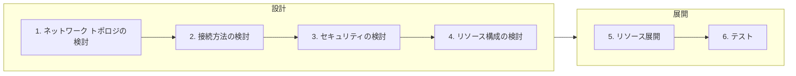

Azure Networking - アプリケーション配信編 # **[prev](../overview.md)** | **[home](./README.md)**  | **[next](./case-study.md)**

# 3. アプリケーション配信のためのネットワーク設計ポイント

## 設計～展開のステップ

Azure のネットワークに関するほとんどのサービスは、 Azure ポータルから数ステップで展開でき、複雑な構成であっても数十分から数時間で展開できます。リソースの作成は非常に簡単ですが、後から変更できない設定が存在することや、後でネットワークの構成を変えるためにダウンタイムが発生することもあります。従って、オンプレミスのネットワーク設計同様、Azure へのネットワーク展開においても設計は非常に重要です。

以下に、Azure のネットワーク展開の流れを紹介します。主に設計にフォーカスし、それぞれのステップのポイントを解説していきます。

## 3.1. ネットワーク トポロジの検討

ネットワークの設計を考える上でまず重要なことはシステム全体のトポロジです。トポロジの設計を疎かにすると、場当たり的なネットワーク展開をすることとなり、可用性や運用性、セキュリティの低下につながります。

トポロジを検討する上で意識することは、東西通信と南北通信です。東西通信は、仮想ネットワーク間やデータセンター間、リージョン間のような`横`のつながりで発生する通信です。一方で、南北通信は、インターネットとの接続やオンプレミスとの接続等、データセンターから出ていく`縦`のつながりで発生する通信です。Azure だけでなくオンプレミス環境を含めたシステム全体のネットワークを前提として通信のフローを考慮します。

以下はトポロジの検討ポイントです。

|東西南北|接続方向|考慮事項|検討の重要性|
|--|:-------|------|---------|
|南北|インターネットへの接続|Azure の仮想ネットワーク内のリソース発信でインターネットへ接続する要件があるか確認します。よくある通信として、OS の更新プログラムの取得やミドルウェア、監視に利用される通信です。Azure を利用する上で必要な通信も発生する可能性もあります。特にパブリッククラウドを利用する上で、インターネットとの通信を含めたユーザーが完全に制御できない通信が発生することは基本的に避けられません。そのような通信の扱いをどう考えるかポリシーを検討する必要があります。|高い|
|南北|インターネットからの接続|Azure の仮想ネットワーク内のリソースに対して、インターネットからのアクセス要件を確認します。リフトアンドシフトのシナリオの場合においてはインターネットからの接続は限定的と考えられます。たとえば不特定多数のユーザーに対して Web サービスを公開する場合においてはインターネットとの接続ポイントが必要であり、そのような通信の必要有無を確認します。必要なリソースのみが確実にアクセス可能かつセキュアな状態を維持できるトポロジを検討します。|高い|
|東西|複数ネットワークの接続|システム規模が大きくなると、複数のネットワークの展開が必要な場合があります。たとえば情シス部門においてネットワークを集中管理したい場合等では管理主体が異なる複数のネットワークが展開されます。ほかにもマルチリージョンに展開された拠点を接続する場合も複数のネットワークが必要です。管理主体・管理方法の違いやリージョンの違いがあるネットワークが存在するのか、それらのネットワーク間をどのように接続するのか(接続しないのか)を検討します。複数の複雑な Azure のネットワーク間を接続する場合、 **ハブアンドスポーク** の構成をまずは検討します。|状況に応じて|
|南北|オンプレミスとの接続|リフトアンドシフトやデータセンターの拡張として Azure を利用する場合、既存のリソースや運用を維持するためにオンプレミスとの接続が必要な場合があります。必要な帯域幅やオンプレミスネットワークのトポロジ(冗長性・災害時の経路)を考慮しながら検討します。また Azure 上の仮想マシンが外部ネットワークへ接続する際にコンプライアンス要件と齟齬がないことを確認します。たとえば、インターネットへの接続が発生する場合に、オンプレミスのプロキシサーバーやファイアウォールの利用を必須とする場合、強制トンネリング等特殊な設定を利用しなければならない場合があります。|状況に応じて|
|東西南北|Azure サービスとの接続|システムによっては Azure の PaaS サービスとの接続(インターネットではないもののユーザーの管理下にないネットワークとの接続が必要なサービス)を利用することがあります。PaaS との接続は Azure のしくみを利用して管理・制御できます。PaaS の利用についても、その扱い(外部接続として扱い可能な限り制御したいのか、柔軟性を持たせたいのか)を検討します。|状況に応じて|

### アプリケーションの特性の確認

アプリケーション配信のプラットフォームとしてネットワークトポロジーを検討する上で重要なことは、アプリケーションのシステム要件や特性を十分に理解しておくことです。IaaS の VM 上にアプリケーションを展開するのか、コンテナを活用したマイクロサービスを Kubernetes 上に展開するのか、アプリケーションコードを PaaS リソース上に展開するのか、サーバーレスアプリケーションを組み合わせて展開するのか等によってネットワークトポロジーが大きく変わります。

特に PaaS リソースを利用する場合、その PaaS リソースで利用できるネットワーク機能に依存することもあるため、サービス選定の際はネットワークの要件も含めて検討します。

以下に挙げる項目も含めて考慮します。

#### 公開範囲、シングル/マルチテナント

社内からのアクセスのみなど一部の限定されたユーザーを対象にするのか、もしくはインターネットに公開され不特定のユーザーを対象にするのかを確認します。

社内からの限定されたユーザーからのみアクセスさせたい場合やデータを特定のリージョンに閉じ込める必要がある場合においては、Front Door のようなリージョンを持たない一部のサービスは適さないことがあります。トポロジーの選択によってシステム全体の SLA にも関係する可能性があります。

また、1 つのアプリケーション(システム)を 1 ユーザーのみに利用させるシングルテナント、もしくは複数のユーザーや企業に利用させるマルチテナントのようなアーキテクチャーの違いによって、求められるスケーラビリティやセキュリティ要件が異なることもあります。その要件によりネットワークトポロジーが変わることもあります。

#### SLA

ワークロード(アプリケーション)で必要な SLA を確認します。SLA はシステム構成におけるすべてのコンポーネントの可用性を決める上でのベースラインとなります。

SLA を確認したうえで、どの通信経路(パス)に障害が発生するとどのような影響を及ぼすかを検証します。たとえば、ユーザーからの通信を受け付けるエンドポイントに障害が発生した場合、EC サイトのようなワークロードでは致命的な影響が発生することとなります。一方で、メッセージングサービスのような非同期なサービスとの通信においては、アプリケーションにおけるキャッシュやリトライでカバーできる可能性があるため、それほど影響はないと考えることもできます。

ちなみに、Azure の GA しているほぼすべてのサービスには SLA の定義がありますが、SLA が 100 %のサービスはほとんどありません。つまり、機能上 SLA が 100 % のシステムは展開できないことを意味します。また、メンテナンス等の運用を考えても SLA が 100 % のシステムは現実的でないと言えます。
システムの SLA を基にアーキテクチャーやネットワークトポロジーを考慮する際において、SLA が 100 %の構成を目指するよりも、予期しない障害に対していかに回復性を持たせるかを考えることが現実的でかつ重要です。

#### 機能要件

ワークロードで使用する機能やプロトコル等の通信要件を確認します。以下に一例を挙げます。

- プロトコルの確認(HTTP/HTTPS/それ以外)
  - いわゆる Web アプリケーションでは、HTTP/HTTPS を用いられることが多く対応したサービスは豊富にあります。逆に HTTP/HTTPS でないプロトコルを使用する場合、利用できるサービスが限られることがあります。
- TLS(HTTPS) の利用
  - クライアントからの HTTPS アクセスを復号化する TLS 終端を利用する場合、該当するサービスを選択する必要があります。また証明書の管理方法を確認します。
  - HTTPS を使用する場合、クライアントの要件として SSL のバージョンや暗号スイートが要件となっていることがあります。要件によっては SSL のポリシーを選択できるサービスを利用する必要があります。
- セッションアフィニティの必要性の有無
  - HTTP では Cookie を利用したセッションアフィニティ(1 つのリクエストを同一のバックエンドに振り分けるしくみ)があります。このしくみを使うためにはセッションアフィニティを利用できるサービスを選択する必要があります。ただし、スティッキーセッションを利用したステートフルなアプリケーションは可用性やスケーラビリティが低下することにつながることもあるため、可能な限りステートレスにすることを検討し、セッション情報を持つ場合であっても外部のストアに保存する検討が必要です。
- WAF の利用
  - インターネットから不正なアクセスをブロックするために Web Application Firewall(WAF) を利用することは推奨される構成です。WAF 機能の有無やサービスの持っている機能を考慮したうえでサービスを選択します。
- キャッシュの利用
  - クライアントからのアクセスをキャッシュし、バックエンドの負荷の削減やレイテンシーの最適化ができます。キャッシュ機能を持っているサービスを選択する必要があります。

#### フェールオーバー

アプリケーションの障害や災害対策を考慮して複数のリージョンやゾーンへのリソースを展開することはよくあるパターンです。可能な限りダウンタイムを減らし運用を継続するためには、アプリケーションの特性に加えフェールオーバーやフェールバックのポリシーを十分に考慮しておく必要があります。アプリケーション配信のプラットフォームを展開する上でフェールオーバーの機能はサービスに大きく依存するため初期フェーズで検討しておきます。

以下に考慮が必要ないくつかのポイントを挙げます。

- アプリケーションの正常性の定義
  - フェールオーバーの前提としてアプリケーションの正常状態・異常状態を定義する必要があります。どのような方法であっても正常・異常の状態が定義できない限りアプリケーションのフェールオーバーは実装できません。異常状態としてたとえば、HTTP のヘルスチェック用のエンドポイントに対する GET メソッドのアクセスで 5 回のアクセス中 3 回失敗する、といったような定義ができます。
- 障害時における影響範囲とダウンタイムの許容範囲
  - 障害時においてどの程度の障害に対してどの程度のダウンタイムを許容するか検討します。要件によってはアクティブ/アクティブ構成やバックアップからのリカバリも選択肢となることがあります。
- フェールオーバー時のアプリケーションの動作
  - Web アプリケーションのフェールオーバーを行うとそれまで処理していたセッションやトランザクションが切断されることとなります。その際にアプリケーションとして不整合が発生しないような実装となっていることを考慮しておく必要があります。
- 自動フェールオーバーの可否
  - フェールオーバー機能を備えているサービスは基本的に自動的なフェールオーバー機能を持っており、これを活用することで人の手を介すことなくアプリケーションの再開を可能とします。しかし、たとえばアプリケーションの実装としてフェールオーバー前に所定のオペレーションを必要とする場合等では自動フェールオーバーをあえて使わないという選択をする必要があります。
- フェールバックの有無とフェールバック時の考慮
  - フェールオーバーしたアプリケーションを元の状態に戻す(フェールバック)ことが必要かどうかを検討します。フェールオーバーと同様にフェールバックに対応したアプリケーションの実装になっているかどうかを確認する必要があります。また Azure のサービスによってはストレージ アカウント等フェールオーバーと同じ手順を取れないサービスがあるためそのようなサービスを利用している際は注意が必要です。

#### PaaS リソースとの接続

Web アプリケーションのワークロードにおいて Web サーバーやアプリケーションサーバーのみで構成されることは少なく、多くの場合リレーショナルデータベース等のデータストアと連携します。特にクラウドではデータベースをマネージドサービスとして提供しておりこれを使うことができます。また、データベースだけではなく非同期処理のためのメッセージングサービスやサーバーレスサービスとの連携をする場合もあります。

これらの PaaS リソースをシステムの一部として組み込む場合においては、セキュリティ・可用性を考慮したうえでどのような機能を利用できるか確認しておく必要があります。上述したように PaaS リソースはそのサービスごとで提供しているネットワーク機能が異なるものもため、特定のサービスで使える機能が別のサービスで使えないことがあります。

## 3.2. 接続方法の検討

トポロジを検討したうえで、具体的にどのようなサービスを利用してネットワークの接続性を確保するかを検討します。

接続方法を検討するうえで特に重要なことは、**それぞれのサービスの機能や制限を十分に理解すること**です。1 つの接続方法を実現するためにさまざまな方法が利用できますが、そのそれぞれの方法がシステムの要件に合っていることを確認する必要があります。設計フェーズだけでなく運用開始後の管理や拡張性の観点も考慮し、運用のし易さ・拡張性の高さ・セキュリティを考慮したサービス選定を行います。

ネットワークに関するサービスだけではありませんが、サービスを選定する際に意識しておくべき点は SLA です。1 つのサービスでも SKU によって SLA が異なります。しかし、多くのサービスではSLA が高くなるとコストも高くなることがあるためシステム要件と予算を考慮して選定します。

サービスについても東西南北のそれぞれの観点で検討すると整理がしやすくなります。

|東西南北|接続方向|サービス例|考慮事項|
|--|:-------|------|---------|
|南北|インターネットへの接続|Azure Firewall / NAT Gateway / Public IP Address|Azure では特に追加のサービスなくインターネットへの通信が可能です。しかし、セキュリティやパフォーマンスを考慮すると既定の接続方式では十分でないことがあるため要件に応じて適切な方法を選択します。|
|南北|インターネットからの接続|Azure Front Door / Application Gateway / Load Balancer / Public IP Address / Azure Bastion|インターネットからの接続の多くは HTTP による Web アプリケーションのための接続です。セッションアフィニティや TLS 終端、キャッシュ等 Web アプリケーションに特化したサービスの利用を検討します。HTTP 通信以外に、インターネット経由で管理目的の通信が必要な場合は Azure Bastion の利用を検討します。|
|東西|複数ネットワークの接続|Virtual WAN / ピアリング / VPN Gateway|Azure のネットワーク間の接続はほとんどの場合、ピアリングもしくは Virtual WAN で実現できます。**ハブアンドスポーク**構成を採用する場合、ハブとなる仮想ネットワークに Azure Firewall や ExpressRoute 等の共通のリソースを展開し、各スポークの通信をハブで制御できる構成を取ります。|
|南北|オンプレミスとの接続|VPN Gateway(Site-to-Site/Point-to-Site) / ExpressRoute|オンプレミスとの接続が必要な場合、VPN Gateway もしくは ExpressRoute を使用します。特定の端末と VPN Gateway を接続できる Point-to-Site を利用することもできます。ExpressRoute のフェールオーバー先として VPN を使用する場合、両方のゲートウェイを展開します。|
|東西南北|Azure サービスとの接続|プライベート エンドポイント / サービス エンドポイント|PaaS との接続をセキュアにするために、サービス ピアリングもしくはプライベート エンドポイントを利用します。プライベート エンドポイントを利用すると、プライベート IP アドレスで PaaS リソースにアクセスが可能になります。よりセキュアな方法としてプライベート エンドポイントを活用できますが、対応していない PaaS リソースもあり、その場合代替手段を利用する必要があります。|

## 参考ドキュメント

- [マルチリージョン n 層アプリケーション](https://docs.microsoft.com/ja-jp/azure/architecture/reference-architectures/n-tier/multi-region-sql-server)
- [Traffic Manager と Application Gateway を使用したマルチリージョンの負荷分散](https://docs.microsoft.com/ja-jp/azure/architecture/high-availability/reference-architecture-traffic-manager-application-gateway)
- [HA/DR 用に構築された多階層 Web アプリケーション](https://docs.microsoft.com/ja-jp/azure/architecture/example-scenario/infrastructure/multi-tier-app-disaster-recovery)
- [Azure のマルチテナント SaaS](https://docs.microsoft.com/ja-jp/azure/architecture/example-scenario/multi-saas/multitenant-saas)
- [PaaS データストアへのプライベート接続を使用したネットワーク強化 Web アプリケーション](https://docs.microsoft.com/ja-jp/azure/architecture/example-scenario/security/hardened-web-app)