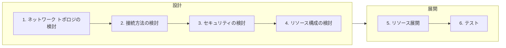

Azure Networking #1 - Azure ネットワークの基礎とハイブリッドネットワークの設計・展開 # **[prev](../overview.md)** | **[home](./README.md)**  | **[next](./case-study.md)**

# 3. ハイブリッドネットワークを展開するための設計ポイント

本章では Azure をオンプレミスの拡張データセンターやリフトアンドシフト先として利用する場合の設計ポイントを紹介します。

## 設計～展開のステップ

Azure のネットワークに関するほとんどのサービスは、 Azure ポータルから数ステップで展開でき、複雑な構成であっても数十分から数時間で展開できます。リソースの作成は非常に簡単ですが、後から変更できない設定が存在することや、後でネットワークの構成を変えるためにダウンタイムが発生することもあります。従って、オンプレミスのネットワーク設計同様、Azure へのネットワーク展開においても設計は非常に重要です。

以下に、Azure のネットワーク展開の流れを紹介します。主に設計にフォーカスし、それぞれのステップのポイントを解説していきます。

## 3.1. ネットワーク トポロジの検討

ネットワークの設計を考える上でまず重要なことはシステム全体のトポロジです。トポロジの設計を疎かにすると、場当たり的なネットワーク展開をすることとなり、可用性や運用性、セキュリティの低下につながります。

トポロジを検討する上で意識することは、東西通信と南北通信です。東西通信は、仮想ネットワーク間やデータセンター間、リージョン間のような`横`のつながりで発生する通信です。一方で、南北通信は、インターネットとの接続やオンプレミスとの接続等、データセンターから出ていく`縦`のつながりで発生する通信です。Azure だけでなくオンプレミス環境を含めたシステム全体のネットワークを前提として通信のフローを考慮します。

以下はトポロジの検討ポイントです。

|東西南北|接続方向|考慮事項|検討の重要性|
|--|:-------|------|---------|
|南北|インターネットへの接続|Azure の仮想ネットワーク内のリソース発信でインターネットへ接続する要件があるか確認します。よくある通信として、OS の更新プログラムの取得やミドルウェア、監視に利用される通信です。Azure を利用する上で必要な通信も発生する可能性もあります。特にパブリッククラウドを利用する上で、インターネットとの通信を含めたユーザーが完全に制御できない通信が発生することは基本的に避けられません。そのような通信の扱いをどう考えるかポリシーを検討する必要があります。|高い|
|南北|インターネットからの接続|Azure の仮想ネットワーク内のリソースに対して、インターネットからのアクセス要件を確認します。リフトアンドシフトのシナリオの場合においてはインターネットからの接続は限定的と考えられます。たとえば不特定多数のユーザーに対して Web サービスを公開する場合においてはインターネットとの接続ポイントが必要であり、そのような通信の必要有無を確認します。必要なリソースのみが確実にアクセス可能かつセキュアな状態を維持できるトポロジを検討します。|高い|
|東西|複数ネットワークの接続|システム規模が大きくなると、複数のネットワークの展開が必要な場合があります。たとえば情シス部門においてネットワークを集中管理したい場合等では管理主体が異なる複数のネットワークが展開されます。ほかにもマルチリージョンに展開された拠点を接続する場合も複数のネットワークが必要です。管理主体・管理方法の違いやリージョンの違いがあるネットワークが存在するのか、それらのネットワーク間をどのように接続するのか(接続しないのか)を検討します。複数の複雑な Azure のネットワーク間を接続する場合、 **ハブアンドスポーク** の構成をまずは検討します。|状況に応じて|
|南北|オンプレミスとの接続|リフトアンドシフトやデータセンターの拡張として Azure を利用する場合、既存のリソースや運用を維持するためにオンプレミスとの接続が必要な場合があります。必要な帯域幅やオンプレミスネットワークのトポロジ(冗長性・災害時の経路)を考慮しながら検討します。また Azure 上の仮想マシンが外部ネットワークへ接続する際にコンプライアンス要件と齟齬がないことを確認します。たとえば、インターネットへの接続が発生する場合に、オンプレミスのプロキシサーバーやファイアウォールの利用を必須とする場合、強制トンネリング等特殊な設定を利用しなければならない場合があります。|状況に応じて|
|東西南北|Azure サービスとの接続|システムによっては Azure の PaaS サービスとの接続(インターネットではないもののユーザーの管理下にないネットワークとの接続が必要なサービス)を利用することがあります。PaaS との接続は Azure のしくみを利用して管理・制御できます。PaaS の利用についても、その扱い(外部接続として扱い可能な限り制御したいのか、柔軟性を持たせたいのか)を検討します。|状況に応じて|

### ハブアンドスポーク構成

Azure のネットワーク間を接続する場合によく利用される構成がハブアンドスポーク構成です。Azure をデータセンターの拡張やリフトアンドシフトで活用する場合、基盤の展開・管理を主導する部門は組織の情報システム部門であることがあります。その場合、情報システム部門は各ユーザー部門のトラフィックの制御や監視を集中的に行う要件が出てくることがよくあります。

そのような要件に対応できる構成や拡張性のし易さを考慮すると、ハブアンドスポーク構成が適しているケースがあります。

ハブアンドスポークを構成するには、中央のネットワークとして情報システム部門が管理する仮想ネットワークを 1 つ展開し、そのネットワークに各ユーザー部門の仮想ネットワークをピアリング接続します。そして、その中央のネットワークには、Azure Firewall や ExpressRoute のゲートウェイを展開します。
Virtual WAN を利用すると、仮想ネットワークの推移的な接続を Virtual WAN で行えるようになる等ハブアンドスポーク構成を展開・管理しやすくなります。

以下のドキュメントには、ハブアンドスポーク構成のベストプラクティスがまとまっています。

- 参考:[Azure のネットワーク トポロジを定義する](https://docs.microsoft.com/ja-jp/azure/cloud-adoption-framework/ready/azure-best-practices/define-an-azure-network-topology)

#### 仮想ネットワークを利用したハブアンドスポーク構成

- 複数の拠点を接続するパターン

#### Virtual WAN を利用したハブアンドスポーク構成

- 複数の拠点を接続するパターン

## 3.2. 接続方法の検討

トポロジを検討したうえで、具体的にどのようなサービスを利用してネットワークの接続性を確保するかを検討します。

接続方法を検討するうえで特に重要なことは、**それぞれのサービスの機能や制限を十分に理解すること**です。1 つの接続方法を実現するためにさまざまな方法が利用できますが、そのそれぞれの方法がシステムの要件に合っていることを確認する必要があります。設計フェーズだけでなく運用開始後の管理や拡張性の観点も考慮し、運用のし易さ・拡張性の高さ・セキュリティを考慮したサービス選定を行います。

ネットワークに関するサービスだけではありませんが、サービスを選定する際に意識しておくべき点は SLA です。1 つのサービスでも SKU によって SLA が異なります。しかし、多くのサービスではSLA が高くなるとコストも高くなることがあるためシステム要件と予算を考慮して選定します。

サービスについても東西南北のそれぞれの観点で検討すると整理がしやすくなります。

|東西南北|接続方向|サービス例|考慮事項|
|--|:-------|------|---------|
|南北|インターネットへの接続|Azure Firewall / NAT Gateway / Public IP Address|Azure では特に追加のサービスなくインターネットへの通信が可能です。しかし、セキュリティやパフォーマンスを考慮すると既定の接続方式では十分でないことがあるため要件に応じて適切な方法を選択します。|
|南北|インターネットからの接続|Azure Front Door / Application Gateway / Load Balancer / Public IP Address / Azure Bastion|インターネットからの接続の多くは HTTP による Web アプリケーションのための接続です。セッションアフィニティや TLS 終端、キャッシュ等 Web アプリケーションに特化したサービスの利用を検討します。HTTP 通信以外に、インターネット経由で管理目的の通信が必要な場合は Azure Bastion の利用を検討します。|
|東西|複数ネットワークの接続|Virtual WAN / ピアリング / VPN Gateway|Azure のネットワーク間の接続はほとんどの場合、ピアリングもしくは Virtual WAN で実現できます。**ハブアンドスポーク**構成を採用する場合、ハブとなる仮想ネットワークに Azure Firewall や ExpressRoute 等の共通のリソースを展開し、各スポークの通信をハブで制御できる構成を取ります。|
|南北|オンプレミスとの接続|VPN Gateway(Site-to-Site/Point-to-Site) / ExpressRoute|オンプレミスとの接続が必要な場合、VPN Gateway もしくは ExpressRoute を使用します。特定の端末と VPN Gateway を接続できる Point-to-Site を利用することもできます。ExpressRoute のフェールオーバー先として VPN を使用する場合、両方のゲートウェイを展開します。|
|東西南北|Azure サービスとの接続|プライベート エンドポイント / サービス エンドポイント|PaaS との接続をセキュアにするために、サービス ピアリングもしくはプライベート エンドポイントを利用します。プライベート エンドポイントを利用すると、プライベート IP アドレスで PaaS リソースにアクセスが可能になります。よりセキュアな方法としてプライベート エンドポイントを活用できますが、対応していない PaaS リソースもあり、その場合代替手段を利用する必要があります。|

### IP アドレス空間の決定

オンプレミスや複数の仮想ネットワーク間を接続する場合、IP アドレス空間が重複しないように意識しておきます。重複した IP アドレス空間を持つネットワークを VPN 等の方法では接続できません。それぞれのリソースが必要とする IP アドレスや将来的な拡張性を考慮して重複がなくかつ十分な大きさの IP アドレス空間を確保します。ただし、セキュリティの観点としてセグメント化を考えた場合、関連のないリソースを 1 つの仮想ネットワークやサブネットに同居させることはお勧めできないため、適度な単位でアドレス空間を分割します。

以下は Azure のリソースで必要なアドレス空間の一例です。

|リソース|推奨されているアドレス空間|備考|
|:-----|:-----|:------|
|VPN Gatway|/27 以上|[ドキュメント](https://docs.microsoft.com/ja-jp/azure/vpn-gateway/vpn-gateway-vpn-faq#do-i-need-a-gatewaysubnet)|
|Azure Firewall|/26|[ドキュメント](https://docs.microsoft.com/ja-jp/azure/firewall/firewall-faq#azure-firewall----26---------------------)|
|Azure Bastion|/26 以上|[ドキュメント](https://docs.microsoft.com/ja-jp/azure/bastion/configuration-settings#subnet)|
|Application Gateway|/24|[ドキュメント](https://docs.microsoft.com/ja-jp/azure/application-gateway/configuration-infrastructure#size-of-the-subnet)|

### 名前解決の提供

仮想ネットワークは、既定で DNS サーバーが提供されており、インターネットへの接続に必要な名前解決で利用できます。また、仮想ネットワーク内に展開された仮想マシンどうしは、仮想マシン名で名前解決が可能です。

しかし、データセンター拡張やリフトアンドシフトシナリオでは、既存の DNS サーバーやドメイン参加のためのドメイン コントローラーの参照が必要になるケースがあります。そのような場合、仮想ネットワークの設定によって、その仮想ネットワークから到達可能な DNS サーバーを指定できます。これは、VPN 等で接続されたオンプレミスやピアリング先のネットワークも含まれており、既存のオンプレミスにある DNS サーバーやハブネットワークの DNS サーバーを参照できます。

また、PaaS リソースと接続する場合にはプライベート エンドポイントに対する名前解決の方法を検討する必要があります。

名前解決のしくみはネットワークのトポロジや設定にも影響するため、早い段階で検討しておきます。

- 参考: [Azure 仮想ネットワーク内のリソースの名前解決](https://docs.microsoft.com/ja-jp/azure/virtual-network/virtual-networks-name-resolution-for-vms-and-role-instances#name-resolution-that-uses-your-own-dns-server)
- 参考: [Q: Private Endpoint に対応したサービスをオンプレミスから利用する場合のベストプラクティスを教えてください](https://github.com/Azure/fta-japan/blob/main/FAQ/Infra/Networking_FAQ.md)

## 3.3. セキュリティの検討

Azure のネットワークセキュリティを考慮する上での基本的な設計ポイントは、`インターネットとの接続`、`セグメント化`、`暗号化`、`監視` です。

セキュリティについては以下のコンテンツも参照してください。

- 参考: [ネットワークに関する検出項目](https://github.com/Azure/fta-japan/blob/main/FTALive/DefenderForCloud/findings.md#%E3%83%8D%E3%83%83%E3%83%88%E3%83%AF%E3%83%BC%E3%82%AF%E3%81%AB%E9%96%A2%E3%81%99%E3%82%8B%E6%A4%9C%E5%87%BA%E9%A0%85%E7%9B%AE)

### インターネットとの接続

パブリッククラウドを普段から利用していると意識が、世界中のあらゆるユーザーが利用しているインターネットは非常に危険なネットワークです。安全にクラウドを利用するためにはインターネットとの送信・受信通信を確実に保護することが必要です。

**受信接続** 接続方法でも解説したように、インターネットからの接続(受信)の多くは Web アプリケーションのための HTTP 接続です。HTTP の保護に関するサービスはさまざまありますが、Web Application Firewall(WAF) を利用できるものを優先して選択します。WAF を使用すると、クロスサイトスクリプティングや SQL インジェクション等のアプリケーションに対する攻撃を未然に防ぐことができます。また DoS 攻撃や bot の攻撃を効率よく防ぐために、`Front Door` 等のグローバルリソースを活用できます。

Web アプリケーションに対する受信接続(HTTP)以外の接続がある場合、慎重に扱う必要があります。HTTP に比べ通信を保護するサービスや機能は多くなく、Azure では `Azure Firewall` の利用が考えられます。またそもそも通信の必要性がなく意図せずインターネットからの接続が開放されてしまっているケースがあります。そのような意図しない設定の検出や設定を強制するために、`Azure Defender for Cloud` や `Azure Policy` を活用します。

|:question: Tips: RDP/SSH ポートの開放に注意する|
|:------------------------------------------|
|インターネットからの接続の例として、管理用に RDP/SSH のポートをインターネット向けに開放しているケースがあります。意図しているかどうかにかかわらず、インターネットからの RDP/SSH 接続は基本的に許可しないことをお勧めします。RDP/SSH のポートは攻撃の対象としてよく知られているポートであり、仮想マシンを起動した瞬間から全世界の攻撃者に無防備にさらされることとなります。許可する場合も少なくても送信元 IP アドレスを特定します。Just-in-Time 機能を利用すると管理がしやすくなります。ただし、そもそも管理用のポートを公開しない方法としてまずは `Azure Bastion` の利用を検討します。|

**送信接続** マルウェアの感染等により意図しないデータ流出を防ぐために、送信接続を限定し悪意のある通信をブロックすることは基本的なセキュリティ機能として検討します。また、OS の更新プログラムやミドルウェアを利用する上でインターネットへの接続を必要とする場合があります。多くの場合、サービスを利用するための特定の IP アドレスが明示されていることが少ないため、`NSG` のみでは十分なアクセス制御ができません。送信接続を FQDN や URL で制御するために、`Azure Firewall` を利用することを検討します。

### セグメント化

セグメント化(セグメンテーション)とは関係するリソースを 1 つにまとめ、境界を作ることで通信の制御を可能とする、ネットワークセキュリティの基本的な考え方です。Azure のネットワークでは、仮想ネットワークがセグメンテーションの最も基本的なリソースです。セグメンテーションのパターンに関しては以下の参考ドキュメントに詳しく記載されています。

- 参考: [Azure にネットワークのセグメント化パターンを実装する](https://docs.microsoft.com/ja-jp/azure/architecture/framework/security/design-network-segmentation)

異なる仮想ネットワークは、ピアリング等の方法を使わない限り完全に独立したセグメントです。リージョンや管理主体が違う場合等では仮想ネットワークを分割します。仮想ネットワーク内のサブネットは、相互で通信ができるため、関係するリソースではあるものの DB と Web サーバーのように役割や機能が違うリソース間で境界を作ることができます。さらに柔軟で集中管理のできるセグメンテーションを行いたい場合は、Azure Firewall を利用します。

セグメンテーションを考慮するとき、その粒度のバランスに注意します。セグメントを大きく切ると 1 つのセグメントで多くのリソースを展開でき、共有リソースの数も少なくできるため、管理性、アドレス空間の有効活用につながります。しかし、デメリットとして共有リソースを利用するリソースが多くなってしまうことから細かいアクセス制御や管理ができなくなります。逆にセグメントを小さく切ると、共有リソースが多くなり 1 つ 1 つのセグメントのアドレス空間が小さくる反面、アクセス制御や管理を柔軟に行えます。

仮想ネットワーク全体で共有するルーティング テーブルの範囲、サブネット単位で設定する NSG / UDR / サービス エンドポイント、ExpressRoute で広報可能なアドレス空間の最大数(Standard 回線では 4000、Premium 回線では 10000)等を考慮する必要があります。

### 暗号化

Azure の仮想ネットワーク間の通信はネットワークの仮想化で実現されており、ほかのユーザーの通信のキャプチャーはできません。仮想ネットワーク内の通信の盗聴の観点においては暗号化は通常必要ありません(コンプライアンスの要件やマルチテナント構成の場合等、要件や構成によって検討が必要な場合はあります)。

Azure への接続において VPN を使用する場合、IPSec による暗号化が行われています。ExpressRoute を使用する場合、暗号化は施されていないため、特に暗号化の要件が必要な場合は ExpressRoute 上で IPSec を利用する等の方法が必要になります。

一方で、インターネットとの接続においては、暗号化は必須と考えます。多くのインターネットサービスは、HTTPS による暗号化通信に対応しています。インターネットから受信方向の通信が発生する場合は、`Front Door` や `Application Gateway` を利用します。

HTTPS を利用する場合、特に公的機関で発行された証明書を Azure のサービスに持ち込む場合においては、証明書の更新忘れに注意します。

|:question: Tips: TLS のバージョンと暗号スイート|
|:------------------------------------------|
|TLS(SSL) にはバージョンがあり、 1.0 や 1.1 は脆弱性のあるバージョンとして各社の OS やブラウザでサポートがされなくなっています。アプリケーション配信においては、アクセス元のデバイスやブラウザが特定できないことも多いため、システムで利用する TLS のバージョンを考慮する必要があります。また、TLS にはバージョンだけでなく、利用できる暗号スイートの概念があります。暗号スイートは TLS のコネクションの初期フェーズでネゴシエーションされ、クライアントとサーバーで利用できるものが採用されます。古い携帯端末等では、TLS 1.2 は利用できるものの対応している暗号スイートが少ないことがあり、Azure のサービスへ接続ができないことも考えられます。要件定義・設計フェーズにおいてはシステムで対応する OS やブラウザのバージョンの仕様を策定し、テストフェーズで想定の動作になっていることを確認します。|

### 監視

通信を監視することで攻撃の最小化や未然防止につながることがあります。また、攻撃があった場合の攻撃元や影響範囲を特定する上でも重要です。

仮想ネットワークの通信の監視は、`Network Watcher` の NSG フロー ログを使います。その名の通り、NSG の機能であり NSG ごとに有効化するため、適切に サブネットや NIC に NSG を設定しておくことが必要です。また、NSG フロー ログはストレージ アカウントに保存し、Log Analytics(Traffic 分析)によって分析します。従ってストレージ アカウントや Log Analytics の展開が必要です。それぞれ展開先のサブスクリプション、リージョン、リソース グループを決定します。

`Front Door` や `Application Gateway` は、診断設定でアクセスログや WAF のログを取得できます。また、メトリックでリクエスト数やレイテンシーを取得できます。セキュリティの観点だけでなくトラブルシューティングやパフォーマンス改善のために**必ずログの取得は設定しておきます**。

## 3.4. リソース構成の検討

Azure のネットワークに関するリソースは、展開するリソースの基本的な構成・設定に影響するため、一度展開すると再作成や変更をしにくい特徴があります。従って、リソースの展開時に考慮が必要な、`サブスクリプション`、`リソース グループ`、`命名規則`、`リージョン` は十分に検討が必要です。

ハブアンドスポーク構成を取る場合、共有の`サブスクリプション`や`リソース グループ`に VPN Gateway / ExpressRoute 回線リソースを展開すると一貫性のある構成がとれます。また、`命名規則`を明確に決めておくことで、管理のし易さにつながります。関連するリソースや管理主体ごとに`リソース グループ`でリソースをまとめるとアクセス制御や管理がしやすくなります。ネットワークリソースの多くはリージョンに展開するものであるため、展開先の `リージョン` を決定します。サービスによって`ゾーン`を持つものがあるため意識しておきます。

以下のドキュメントを参照してください。

- 参考:[Azure リソースの効果的な整理](https://docs.microsoft.com/ja-jp/azure/cloud-adoption-framework/ready/azure-setup-guide/organize-resources)
- 参考:[名前付け規則を定義する](https://docs.microsoft.com/ja-jp/azure/cloud-adoption-framework/ready/azure-best-practices/resource-naming)

|:question: Tips: リソースの展開を自動化する|
|:------------------------------------------|
|Azure のリソースの展開はポータルから行う方法が一番手軽な方法です。しかし、ポータルからの展開は、1 つ 1 つ手作業でリソースを作成していく必要があり時間がかかります。検証環境と本番サブスクリプション等複数のサブスクリプションへの展開や、複数のネットワークの展開、設定を間違えてしまった場合の再展開等を考え、可能な限り自動化をしておくことをお勧めします。Azure には組込みでテンプレート機能が提供されており、簡単にコード化できます。ただし、初めてコード化に取り組む場合学習コストがかかることは避けられないため、設計の初期段階でリソース展開の自動化を検討しておきましょう。|
