# WVD アーキテクチャー デザイン ガイド (Powered By FTA)

1. 必要条件
2. コンセプト
3. ネットワーク要件
4. デザイン パターン
5. ログとモニタリング
6. 各種ツール

このドキュメントは FTA (FastTrack for Azure) のメンバーによって管理されているものであり、WVD (Windows Virtual Desktop) 環境を新たに作成されようとしている方に対して WVD に対する理解を深め、多様なビジネス要件を満たすために WVD や Azure が提供している機能やそのつながりを理解してもらうために作成したものです。

内容は FTA のメンバーによって適宜更新されますが、内容の正しさを保証するものではありません。WVD に関する最新の情報や WVD の正確な仕様を確認する場合は必ず[公式ドキュメント](https://docs.microsoft.com/ja-jp/azure/virtual-desktop/overview)を参照してください。また、ここでは Microsoft が提供する Native WVD についてのみ取り扱います。Citrix 社や VMWare 社によって提供される WVD については本資料では基本的には触れません。

FTA (FastTrack for Azure) 組織については[こちら](https://azure.microsoft.com/ja-jp/programs/azure-fasttrack/)を参照ください。

 

## 1. 必要条件
---
WVD は Microsoft Azure 上で動作する仮想デスクトップを提供するサービスです。WVD を動作させるには最低限以下のコンポーネントが必要です。

- Azure サブスクリプション
- Azure AD テナント
- Windows Active Directory 環境（Azure Active Directory Domain Service でも可）
- 適切なライセンス（https://azure.microsoft.com/ja-jp/pricing/details/virtual-desktop）

WVD は以下図のイメージでAzureサブスクリプションのvNet内に展開したVMにWVD Agentをインストールし、VDI として利用します。WVD を展開する際に必要となるコンポーネントについてご説明します。

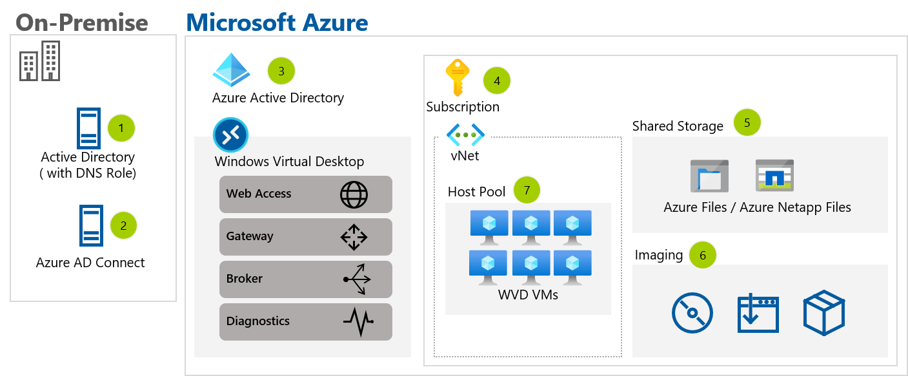

1．Active Directory Domain Service (ADDS)
- WVD VM が参加するドメインコントローラー
-  ADDS の選択肢は複数存在し、お客様のご要件に応じて柔軟に選択できます。
    - オンプレミスに存在する既存 AD
        - AzureとオンプレミスDCを専用線 / VPNで接続し、WVDで利用するAzure上のVMをオンプレミスのADに参加
    - Azure IaaS上に新規構築
    - Azure の AD サービス (Azure Active Directory Domain Service) を利用

2. Azure AD Connect
	- AD/DNSからUPNをAzure ADへ同期
	- 既存でAzure AD Connectを利用している場合は注意が必要
※AADCがサポートするトポロジ
	- Azure AD ConnectはWindows Serverに対してソフトウェアをインストールし、構成する
Azure AD ConnectでADからAzure ADへ同期する設定を実施する際には以下留意点が存在
・同期設定時、Azure ADのグローバル管理者権限をもったアカウントが必要
・同期設定時、ADへのエンタープライズ権限をもったアカウントが必要
・グローバル管理者は他のAzure ADからゲスト招待されているユーザーは不可

3. Azure AD
	- WVDにアクセスするユーザーはAzure ADの認証基盤でログイン認証を実施
	- 複数のAzure ADテナントが存在する場合は注意が必要
※構築の際に問題になることが多いPoint
	- WVDにアクセスする際にAADの多要素認証機能の利用が可能
・Azure AD Premier P1ライセンス以上が必要
	- AADにはWVDにアクセスするユーザーがADDSから同期されている
・別のAzure ADから招待されたゲストユーザー、AzureAD B2B はWVDへのアクセスが不可

4. Azure サブスクリプション
	- WVDのマシンを展開するAzureサブスクリプション
- WVDにアクセスするユーザーが存在するAzure ADテナントに紐づくAzureサブスクリプションが必要

 

## 2. コンセプト
---
<!--
2.	Concept of WVD (Managed Control plane and Win10 EVD and FSLogix are WVD specific)
-->
ここでは WVD とはいったい何なのか、従来の VDI / RDS ベースのソリューションとは一体どこが違うのか、主に技術的な観点で違いを説明します。

### マネージドな管理サーバー（WVD コントロール プレーン）
WVD とは既存のオンプレミス VDI (Virtual Desktop Infrastructure) や RDS (Remote Desktop Service) ソリューションを Microsoft Azure のクラウド サービスを使って置き換えるものです。
オンプレミスで VDI や RDS ソリューションを構築しようとすると、ホストへの接続を管理するブローカー サーバーやゲートウェイ サーバー、ライセンスを管理するライセンス サーバー、Web からのアクセスを受け付ける Web サーバーが必要でしたが、WVD ではこれらの管理系のサーバーが SaaS に近いマネージド サービスとして提供されるため、ユーザーがこれらの管理系のサーバーの運用や管理を行う必要がなくなります。また、1章で記載したライセンスを持っていればこれらの管理系のサービスに対する従量課金によるコストは発生しません。これが WVD を利用する上での大きなメリットになります。

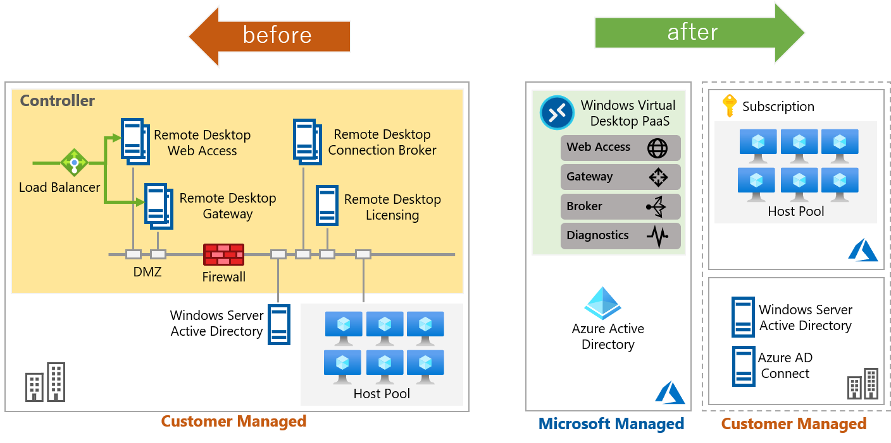

### WVD 専用 OS 
WVD の利用形態は大きく分けて2つあります。VDI 型（仮想マシン占有型）と RDS 型 (仮想マシン共有型) です。

VDI 型で使用する OS はオンプレミスで使用する Windows 10 Enterprise (Professional は WVD では使用できません) と同じイメージを利用できますので、基本的には既存 VDI との違いは管理サーバーが Azure によるマネージド サービスかどうかだけです。

RDS 型では複数ユーザーによる同時ログインを実現するため、オンプレミスでは Windows Server がホスト OS として利用されてきましたが、WVD では Windows Server だけでなく、Windows 10 Enterprise Multisession という独自 OS を利用することが新たに可能になりました。この OS は WVD の利用を想定して Windows Server をベースに作成されたもので、従来の Windows 10 では実現できなかった複数ユーザーによる同時ログインを実現できるようになっており、これによって RDS 型のサービスを Windows 10 で提供することができるようになりました。

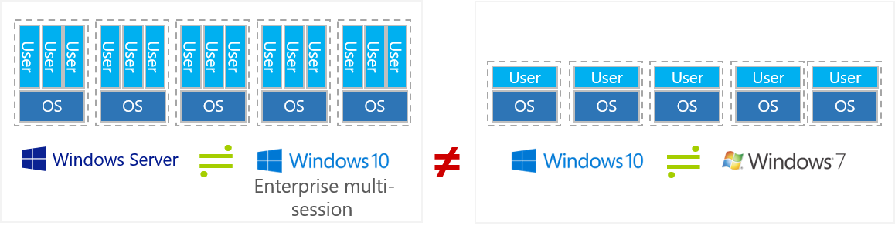

### FSLogix によるプロファイル管理
主に Windows 10 Multisession OS に対する付加価値を与える機能として、従来の RDS ソリューションで使用されていたリモート ユーザー プロファイルは、FSLogix という Microsoft が買収した製品によって置き換わりました。Windows 10 Multisession を使用する際には必ず FSLogix を使わなければならないということではありませんが、パフォーマンスや信頼性に優れ、また GPO による細かな管理も可能であることから、仮想マシン共有型（プール型）で WVD を利用する際には利用が推奨されています。
  
 
## 3. ネットワーク要件
---
<!--
3.	WVD Networking (Required Traffic for both WVD session-host and client device)
-->
上述したように WVD ではゲートウェイや Web アクセスのためのサーバーがサービス化され、それらのサーバーに対する管理が必要なくなった半面、ユーザーが管理する必要があるセッション ホストと、Microsoft によって提供される管理系のサーバーが完全に分離された形となっています。そのため、これらがお互いに通信して WVD がサービスとして正常に動作するためのネットワークについては、オンプレミスとは全く異なる設計や考慮が必要になります。

具体的には以下が大きな違いとなります。

###  3.1. オンプレミス Active Directory と Azure Active Directory の同期
WVD を利用する前提条件として記載したように、WVD は基本的にはオンプレミス Active Directory （もしくは Azure Active Directory Domain Service）と同期された Azure Active Directory が必要になります。これらは基本的には Azure AD Connect によりユーザーが同期されている必要がありますので、同期のためのネットワーク接続が必要です。

### 3.2. クライアントからの接続
WVD を使用したセッションホストへの接続は WVD コントロール プレーンと呼ばれるインターネットに公開されたエンドポイント経由で実施します。言い換えると、インターネット カフェやスマートフォンなどからもネットワーク的には接続が可能な状態となっているため、必要に応じてパブリック エンドポイントへのアクセスを制限するための考慮が必要になります。

WVD コントロールプレーンへの接続時には Azure AD での認証となるため、Azure AD 側の設定で MFA (Multi Factor Authentication) を導入したり、アクセス可能なソース IP 範囲を限定するような対応が一般的です（これらを利用するには Azure AD 条件付きアクセスという Azure AD Premium で利用できる機能が必要です）。

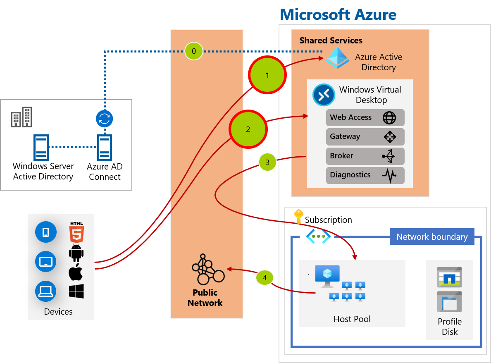

### 3.3. セッションホストと WVD コントロール プレーン間の接続
ユーザーが管理する Azure Virtual Network 内のセッションホストとパブリックなエンドポイントを持つ WVD コントロールプレーン間のネットワーク接続が必要です。細かい内容は [こちら](https://azure.microsoft.com/ja-jp/programs/azure-fasttrack/) を参照してもらえればと思いますが、具体的にはクライアントとの画面転送のためのトラフィックや、必要なエージェントをダウンロードしたり更新したりするための通信等となります。

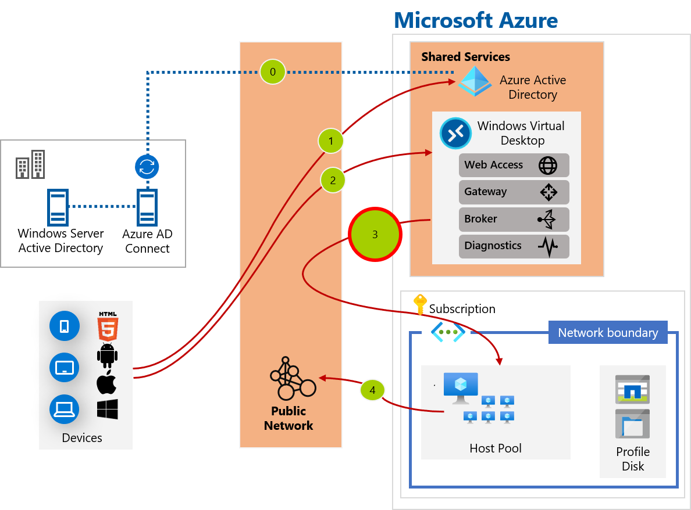

### 3.4. セッションホストからインターネットへの接続
こちらは WVD 特有という意味ではありませんが、ユーザーがセッションホストに接続した後のインターネット接続に対する考慮が必要です。既定では Azure Virtual Network (Vnet) からインターネットに向けた通信は許可されており、監視等もされていないため、必要に応じてアクセスを制限したリプロキシ サーバーや Azure Firewall を経由させるなどの考慮が必要になります。こちらは WVD セッションホストに限らず、Virtual Machine を Azure 上にデプロイする際に一般的に考慮する必要があるものになります。

 

## 4. デザイン パターン
---
ここでは上述したような基礎的な WVD の概要が押さえられていることを前提として、一般的なエンタープライズ環境で WVD を利用する場合によく採用される実践的な構成例を紹介します。

まずは以下の全体像をご覧ください。

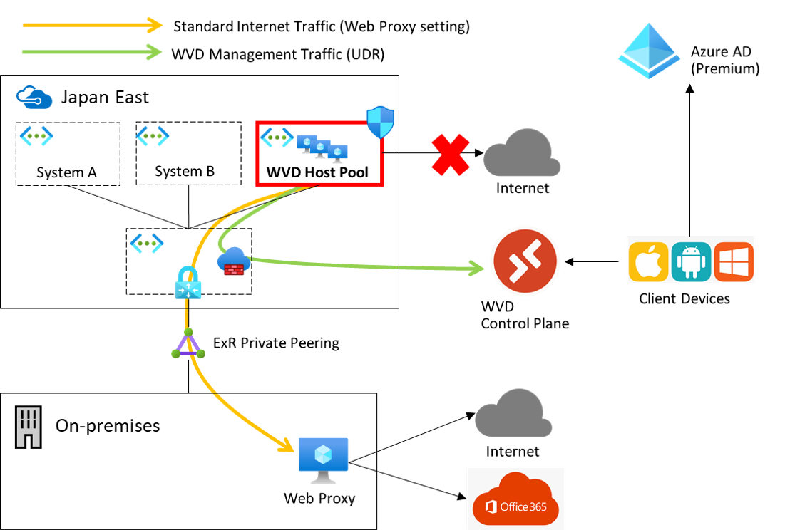

ここには Azure を使ったハイブリッド クラウド環境におけるベストプラクティスが採用されています。具体的には以下のようなものです。これから一つずつ詳しく見ていきます。

- ハブ & スポークモデル
- 2種類のルートを使ったインターネット分離

### 4.1 ハブ & スポーク モデル
Azure で仮想マシンを動作させるには仮想ネットワーク (Vnet) という論理的なネットワークを作成し、そこに仮想マシンを接続させる必要があります。一つの仮想ネットワーク内に Azure 上で動作する全ての仮想マシンを入れ込むことも可能ですが、拡張性や柔軟性に欠け、システム境界を定義してセキュリティを確保することも不可能ではありませんが煩雑になります。

そこで複数の仮想ネットワークを相互に接続し、システム毎の境界を仮想ネットワーク単位で分離する構成を取ることが、拡張性や柔軟性の観点で推奨されています。この構成は複数のシステムから共通して利用される Vnet を中心に一つだけ配置し、システム単位で作成した Vnet は中心の Vnet から車輪のスポークのように複数配置することからハブ & スポーク モデルと呼ばれています。

スポーク Vnet 同士は既定では互いに通信できないため、システム毎のセキュリティ境界が分かりやすいことや、新たにセキュリティ境界を分けてシステムを追加したい場合にもスポーク Vnet をハブに繋げればよく、将来に向けた拡張性もある構成となります。

また、必須ではありませんが、ハブ Vnet にはインターネットとのセキュリティ境界となる Azure Firewall が配置されるケースが多数あります。スポーク内の各 VM がインターネットに通信する際に Azure Firewall を経由させるようにすることで Azure Firewall が DMZ として機能し、クライアントが外部に接続する際の通信を Azure Firewall で一元的に理することが可能になります。

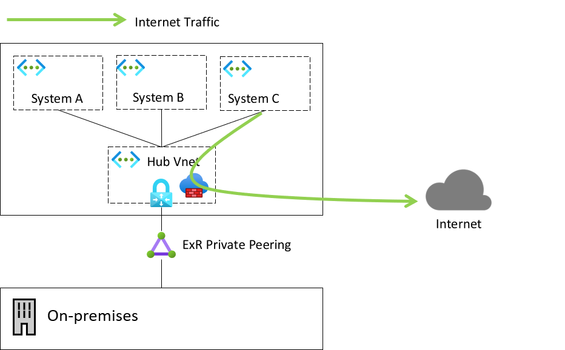

### 4.2 2種類のルートを使ったインターネット分離

上記ではハブ & スポークと Azure Firewall について簡単に説明しましたが、多くのエンタープライズ環境ではオンプレミスに既に Web プロキシーを配置しており、Azure 上の仮想マシンから一般的なインターネット向けの通信を行う場合にもオンプレミスのプロキシーを経由することが原則として求められているケースがあります。

ただし、この構成を取ってしまうと WVD のセッションホストが行う画面転送などの管理用の通信もオンプレミスを経由してしまうため、ユーザーによるデスクトップ操作時の遅延やネットワーク帯域の圧迫に繋がってしまいます。

そのような状況を解決するのがここで紹介する2種類のルートを使ったインターネット分離の構成です。これは、WVD のセッションホストが使用する管理用の通信はオンプレミスを経由させずに Azure Firewall を通して直接 WVd コントロールプレーンに到達させ、インターネットブラウジング等の Web 向けの通信についてはオンプレミスのプロキシーを経由させる構成です。

実現方法としてはインターネット向けの既定のルートを Azure Firewall に向けるようにルートテーブルを上書きし、Web 向けの通信はオンプレミスのプロキシサーバーを経由するように GPO 等でクライアント端末に設定を行います。また、必要に応じて PAC ファイルにより URL 毎の設定も行います。

何れの通信もプロキシーもしくは Azure Firewall を経由するため、これらの境界で宛先 URL の制御やロギングを行うことができます。

 

## 5. ログとモニタリング
---
ここでは WVD に限らない Azure を使用する際のログの考え方や取得方法を紹介します。

Azure でのログ取得は Azure Monitor というサービスが担う形となっており、WVD はもちろん、その他の Azure 上の PaaS サービス (App Service 等) や IaaS サービスを使う場合でも基本的には Azure Monitor によるロギングや監視を行うことになります。ちなみに "Azure Monitor" という用語は Azure 上でのモニタリング機能を提供する広義の用語としても使用されますが、多くのケースではその実態は LogAnalytics ワークスペースというログ取得／分析サービスによって行われます。

誤解を恐れずに言えば WVD の文脈では Azure Monitor ≒ LogAnalaytics だと思って頂いて問題ありません。

Azure Monitor (LogAnalytics) では WVD 関連の情報だけなく、Azure AD でのユーザー認証情報や Azure サブスクリプション内でのユーザー操作、WVD 内部の OS のパフォーマンスログや、カスタマイズされたログの取得をすることができますが、既定では取得はされません。WVD を使う上では必要に応じてこれらのログを取得する設定を行う必要があります。

以下が取得を検討すべきログの一覧になります。これから一つずつ紹介していきます。

|カテゴリ	| 内容|
|----|----|
|Azure AD テナント（ID 管理）	|Azure AD サインインログ、監査ログ|
|Azure サブスクリプション	|Azure Activity log|
|Azure リソース（hostpool など）|Service Health、診断ログ、メトリック|
|OS |イベントログ、perf ログなど|
|アプリケーション|	アプリ固有のログ|

### 5.1 Azure AD テナント
WVD を使用する上では Azure AD が必須です。Azure AD では WVD 環境を構築する上で Azure サブスクリプションにログインするユーザーの認証や、WVD 利用ユーザーの認証が行われますので、これらのユーザーが認証された際のログを残しておく必要があります。このログは既定で Azure 内部に保存されていますが、Azure AD Premium を使用している場合でも [30日間のみの保存](https://docs.microsoft.com/ja-jp/azure/active-directory/reports-monitoring/reference-reports-data-retention#how-long-does-azure-ad-store-the-data)となり、それ以前のデータを遡って見る事はできません。そのため、必要に応じて Azure Monitor (LogAnalytics) にエクスポートする設定としておき、30日以上前のデータを遡って分析できるようにしておきます。

具体的な設定方法については [Azure AD ログを Azure Monitor ログと統合する](
https://docs.microsoft.com/ja-jp/azure/active-directory/reports-monitoring/howto-integrate-activity-logs-with-log-analytics) を参照してください。

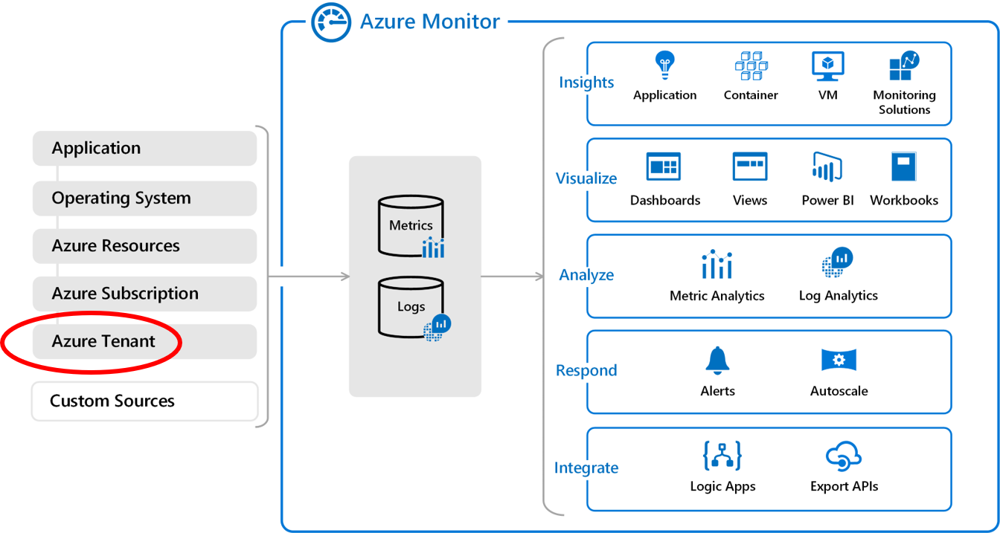

### 5.2 Azure サブスクリプション
WVD ホストプールを含む Azure リソースは Azure サブスクリプション内に作成する形になりますが、この際のリソース操作に関する情報、例えばリソースの作成／削除／変更等の操作を後から参照できるようにしておくことも重要です。このログは Azure Activity ログと呼ばれており、こちらも既定では90日間 Azure 内部で自動的に保存がされていますが、それ以上前の情報を遡って参照したい場合や、LogAnalytics による分析を行いたい場合には必要に応じて Azure Monitor にエクスポートする設定をしておく必要があります。

具体的な設定方法については [Azure AD ログを Azure Monitor ログと統合する](
https://docs.microsoft.com/ja-jp/azure/active-directory/reports-monitoring/howto-integrate-activity-logs-with-log-analytics) の "Log Analytics ワークスペースに送信する" を参照してください。

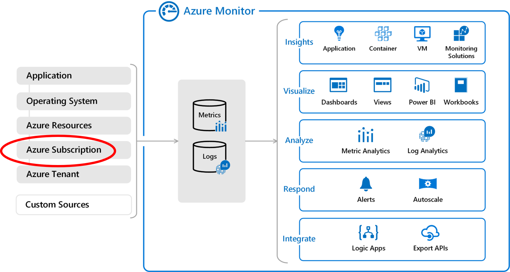

### 5.3 Azure リソース
WVD に限りませんが、Azure 上の多くのサービスは "診断設定" から LogAnaltyics ワークスペースにログを送信する設定を行うことができます。WVD のそのようなサービスの一つで、WVD ホストプールに対するユーザーのログイン操作のログや、エラーが発生した際のログを取得することができます。これらのログは既定では Azure 上で取得されないため、明示的にログを取得する設定を行っておく必要があります。

具体的な設定方法については [診断機能に Log Analytics を使用する](
https://docs.microsoft.com/ja-jp/azure/active-directory/reports-monitoring/howto-integrate-activity-logs-with-log-analytics) を参照してください。このドキュメントにはログを取得した後にログをクエリーするサンプルも紹介されています。

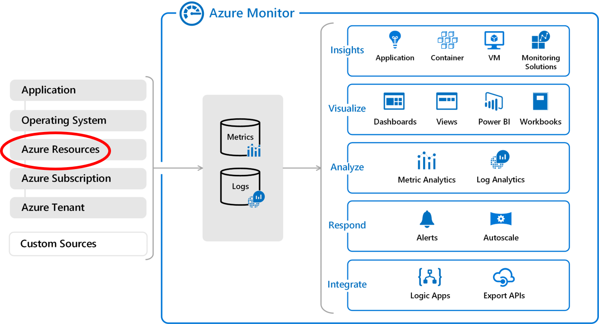

### 5.4 OS
Windows OS 内のログ、イベントログやパフォーマンスログは、Azure Monitor for VMs という機能と通じて簡単に取得することができます。この機能を有効化すると、Azure VM 内にログ取得のためのエージェントが Windows 上でのサービスとしてインストールされ、定期的にこれらの情報を LogAnalytics ワークスペースに送信します。

具体的な設定方法については [Azure Monitor for VMs の有効化の概要](
https://docs.microsoft.com/ja-jp/azure/azure-monitor/insights/vminsights-enable-overview) を参照してください。また、取得した後の分析に関する情報は [VM 用 Azure Monitor を使用してパフォーマンスをグラフ化する方法](https://docs.microsoft.com/ja-jp/azure/azure-monitor/insights/vminsights-performance) を参照してください。

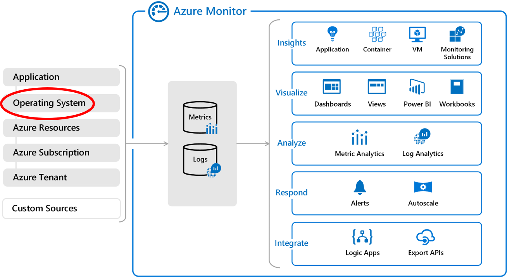

### 5.5 アプリケーション
サードパーティ製の製品等のログについても、場合によっては Azure Monitor で分析することができます。Azure Monitor (LogAnalytics) にはカスタムログ取得機能があり、テキストベースのログについては Azure に送信することができます。具体的な設定方法は以下の [Azure Monitor で Log Analytics エージェントを使用してカスタム ログを収集する](https://docs.microsoft.com/ja-jp/azure/azure-monitor/platform/data-sources-custom-logs) を参照してください。

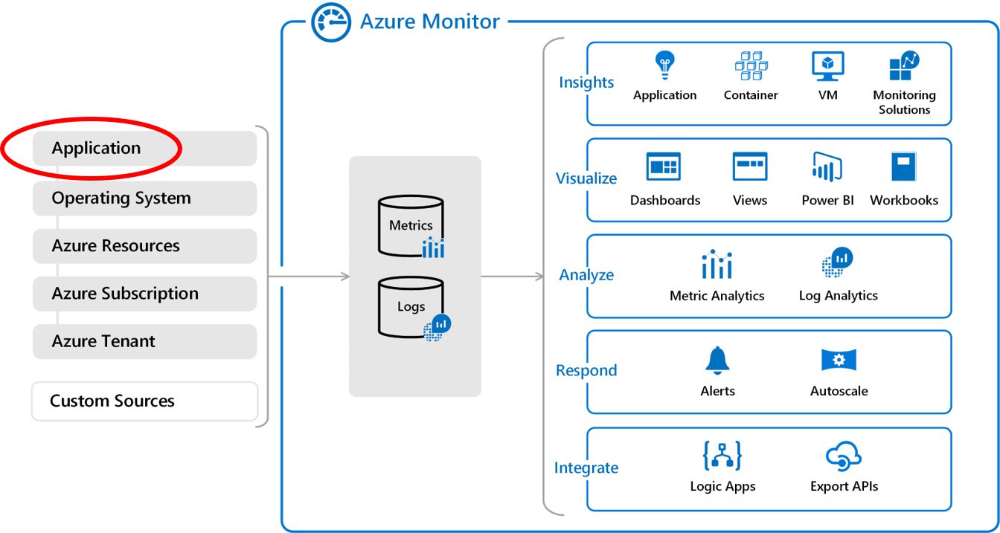

 

## 6. 各種ツール
---

ここでは Microsoft Native WVD を利用する上で役立つツールやリンク情報をご紹介します。

### 6.1 スケーリングツール

基本的にはプール型の WVD を利用する場合特有のものですが、セッションホスト仮想マシンをコストパフォーマンスを意識して効率よく使用するためには、ピーク時間／オフピーク時間を定義して、トータルの仮想マシン台数を増減させる対応が必要です。この作業を自動化するツールがここで紹介するスケーリングツールとなります。使用方法は以下のドキュメントに纏められています。

[Azure Automation を使用してセッション ホストをスケーリングする](https://docs.microsoft.com/ja-jp/azure/virtual-desktop/set-up-scaling-script)

### 6.2 Azure Monitor Workbook によるモニタリング
上述したログ情報を Azure Monitor (LogAnalytics ワークスペース) に送信してあることが前提ですが、Azure Monitor の Workbook (ブック) 機能を使用して収集したログ情報を簡単にダッシュボード化して監視することができます。
具体的な設定内容は以下のドキュメントに纏められています。設定方法は単純で、github 上で公開されているテンプレートを Azure 上にインポートするだけですぐに使うことができます。

[Proactively monitor ARM-based Windows Virtual Desktop with Azure Log Analytics and Azure Monitor](https://techcommunity.microsoft.com/t5/windows-it-pro-blog/proactively-monitor-arm-based-windows-virtual-desktop-with-azure/ba-p/1508735)

### 6.3 参考リンク情報

[WVD および FSLogix 関連の各種公開情報](https://jpwinsup.github.io/blog/2020/11/05/RemoteDesktopService/WVD/wvd-fslogix-useful-links/) (日本マイクロソフト サポートチームによる Blog)

[くらう道](https://www.cloudou.net/) (日本マイクロソフト 社員によるブログ記事)

<!---

7.	WVD  ID Security (Optional) 
  i.	Azure AD Conditional Access (Azure AD Premium) 
  ii.	Intune 
  iii.	MDATP
8.	WVD Image management (Optional) 
  i.	Capture images 
  ii.	Shared Image Gallery 
9.	WVD Misc (Optional)
  i.	vCPU Quota
  ii.	Scale limit (https://docs.microsoft.com/ja-jp/azure/architecture/example-scenario/wvd/windows-virtual-desktop)

-->

